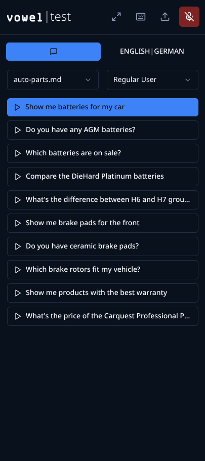
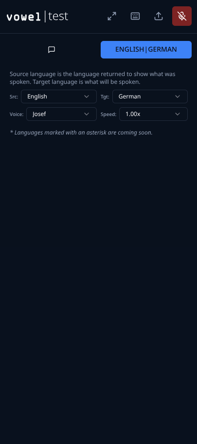

# vowel | speaktest

A comprehensive test helper for the [vowel.to](https://vowel.to/) conversational voice assistant, providing both Talker (TTS) and Listener (STT) capabilities with multi-language support.

NOTE: This app is best served from a mobile device when testing vowel enabled applications.

|  |  |
|:---:|:---:|
| **Phrase Management** | **Language Configuration** |

## Resources

- [vowel.to Website](https://vowel.to/)
- [vowel Documentation](https://docs.vowel.to/)
- [vowel YouTube Channel](https://www.youtube.com/@voweldotto)

## Features

### 🎤 Talker (Text-to-Speech)
- **Project Management**: Organize phrases in folder-based projects
- **Markdown Support**: Load and navigate through markdown files with phrases
- **Multi-language TTS**: 7 languages with 90+ voices (see [Language Support](#language-support))
- **Auto-translation**: Translate text from source language to target language using Groq GPT-OSS-20B
- **Keyboard Navigation**: Navigate phrases with arrow keys, play with spacebar
- **Real-time Playback**: High-quality text-to-speech using Deepgram TTS
- **Smart Caching**: Automatic disk-based caching of TTS responses to save API credits and improve performance
- **Voice Selection**: Choose from available voices for each language
- **Speed Control**: Adjust playback speed from 0.25x to 2.0x with granular options
- **File Upload**: Upload markdown files directly through the UI

### 🎧 Listener (Speech-to-Text)
- **Voice Activity Detection (VAD)**: Automatic speech detection and recording
- **Multi-language STT**: 7 languages matching TTS availability (see [Language Support](#language-support))
- **Real-time Transcription**: Live transcription with confidence scores
- **Transcription Management**: Sort, filter, search, and export transcriptions
- **Adjustable Sensitivity**: Customize VAD sensitivity for different environments
- **Silence Detection**: Automatic recording stop after silence period
- **Max Recording Duration**: Configurable maximum recording time

### 🔧 Technical Features
- **State Management**: Zustand stores for feature state
- **API Integration**: Deepgram (TTS & STT), Groq (Translation)
- **Performance**: TTS caching, optimized rendering
- **TypeScript**: Full TypeScript support throughout
- **Hot Module Replacement**: Fast development with HMR

## Language Support

This application provides **intersected language support** for both Text-to-Speech (TTS) and Speech-to-Text (STT), meaning only languages available in **both** capabilities are selectable. This ensures a seamless experience where you can both speak and listen in the same language.

### Supported Languages (TTS + STT)

| Language | Variants | TTS Voices | STT Support |
|----------|----------|------------|-------------|
| **English** | US, UK, Australian, Irish, Filipino | 42 voices | ✅ |
| **Spanish** | Mexican, Peninsular, Colombian, Latin American | 16 voices | ✅ |
| **German** | Standard | 7 voices | ✅ |
| **French** | Standard | 2 voices | ✅ |
| **Italian** | Standard | 10 voices | ✅ |
| **Japanese** | Standard | 5 voices | ✅ |
| **Dutch** | Standard | 9 voices | ✅ |

### Voice Providers

- **TTS (Text-to-Speech)**: [Deepgram Aura](https://developers.deepgram.com/docs/tts-models) - High-quality neural voices
  - 90+ voices across 7 languages
  - Multiple variants per language (e.g., US/UK/Australian English)
  - See [Deepgram TTS Documentation](https://developers.deepgram.com/docs/tts-models) for full voice listings

- **STT (Speech-to-Text)**: [Deepgram Nova](https://developers.deepgram.com/docs/stt-models) - Industry-leading transcription
  - Supports all 7 TTS-matching languages
  - See [Deepgram STT Documentation](https://developers.deepgram.com/docs/stt-models) for language support details

> **Note**: While Deepgram STT supports 100+ languages, this application intentionally limits STT selection to the 7 languages that also have TTS support, ensuring users can both speak and listen in their chosen language.

## Tech Stack

- **Frontend**: React 18 + TypeScript + Vite + TanStack Router
- **Backend**: Cloudflare Workers + TypeScript
- **Styling**: Tailwind CSS + shadcn/ui
- **State Management**: Zustand
- **AI Services**:
  - **Deepgram** - TTS & STT (Nova-2, Aura voices)
  - **Groq** - Translation (GPT-OSS-20B)
  - **Groq** - Alternative STT (Whisper)

## Prerequisites

- Node.js 18+ or Bun
- API Keys:
  - `DEEPGRAM_API_KEY` - Deepgram API key (for both TTS and STT)
  - `GROQ_API_KEY` - Groq API key (for translation and alternative STT)

## Installation

1. **Clone and install dependencies:**
   ```bash
   bun install
   cd client && bun install
   cd ../server && bun install
   ```

2. **Set up environment variables:**
   Create a `.env` file in the root directory:
   ```env
   DEEPGRAM_API_KEY=your_deepgram_api_key_here
   GROQ_API_KEY=your_groq_api_key_here
   CLIENT_URL=http://localhost:8080
   PORT=9090
   NODE_ENV=development
   ```
   
   **Note:** 
   - Get your Deepgram API key from [https://deepgram.com/](https://deepgram.com/)
   - Get your Groq API key from [https://groq.com/](https://groq.com/)
   - Deepgram provides both TTS (Aura voices) and STT (Nova-2) services
   - Groq provides translation via GPT-OSS-20B and alternative STT via Whisper

3. **Start the development servers:**
   ```bash
   # Start both client and server
   bun run dev
   
   # Or start individually:
   bun run dev:server  # Server on port 9090
   bun run dev:client  # Client on port 8080
   ```

## Usage

### Talker Mode
1. **Select a Project**: Choose from existing projects or create a new one
2. **Choose a File**: Select a markdown file containing phrases
3. **Set Languages**: Configure source and target languages
4. **Navigate & Play**: Use arrow keys to navigate, spacebar to play phrases

**Keyboard Shortcuts:**
- `↑/↓` - Navigate between phrases
- `Space` - Play/Stop current phrase

### Listener Mode
1. **Select Language**: Choose target language for transcription
2. **Adjust Sensitivity**: Set VAD sensitivity based on your environment
3. **Start Listening**: Click "Start Listening" to enable voice detection
4. **Speak**: Talk naturally - recording starts/stops automatically
5. **Manage Transcriptions**: View, filter, sort, and export your transcriptions

## Project Structure

```
/
├── client/                 # React frontend
│   ├── src/
│   │   ├── components/     # UI components
│   │   ├── hooks/          # Custom React hooks
│   │   ├── lib/            # Utilities and API client
│   │   ├── stores/         # Zustand state management
│   │   └── routes/         # TanStack Router routes
├── server/                 # Cloudflare Workers backend
│   ├── src/
│   │   ├── handlers/       # API handlers
│   │   ├── services/       # Business logic & caching
│   │   └── routes/         # API routes
├── shared/                 # Shared types and constants
└── sample-project/         # Example project with phrases
```

## API Endpoints

### Core Endpoints
- `GET /api/projects` - List all projects
- `GET /api/projects/:id` - Get specific project
- `POST /api/projects` - Create new project
- `POST /api/translate` - Translate text
- `POST /api/tts` - Text-to-speech synthesis
- `POST /api/stt` - Speech-to-text transcription
- `GET /api/transcriptions` - List transcriptions
- `POST /api/transcriptions` - Add transcription

### TTS Cache Management
- `GET /api/tts/cache/stats` - Get cache statistics (hits, misses, size, hit rate)
- `DELETE /api/tts/cache` - Clear TTS cache

## Development

### Adding New Languages
1. Update language constants in `shared/constants.ts`
2. Add language mappings for display names
3. Test with your API providers

### Creating Projects
Projects are simply folders containing markdown files. Each markdown file is parsed for phrases (headings and text lines).

### Customizing VAD
Adjust sensitivity, silence duration, and max recording time in the Listener controls or modify defaults in `shared/constants.ts`.

## Troubleshooting

### Common Issues

1. **Microphone Access Denied**
   - Ensure HTTPS or localhost
   - Check browser permissions
   - Try refreshing the page

2. **TTS/STT Not Working**
   - Verify `DEEPGRAM_API_KEY` is set correctly in `.env`
   - For translation issues, verify `GROQ_API_KEY` is set correctly
   - Check network connectivity
   - Ensure Deepgram service is available at https://deepgram.com/
   - Ensure Groq service is available at https://groq.com/
   - Verify API keys have sufficient credits
   - Check server logs for detailed error messages

3. **TTS Cache Management**
   - Cache automatically stores TTS responses to disk in `server/tts-cache/` directory
   - Cache persists across server restarts (survives deployments)
   - Cache uses SHA-256 hashing based on text, language, voice, and speed parameters
   - Monitor cache performance: `GET /api/tts/cache/stats`
   - Clear cache if needed: `DELETE /api/tts/cache`
   - Cache statistics include: hits, misses, size, and hit rate percentage
   - Cache directory is automatically excluded from git via `.gitignore`

### Browser Compatibility
- Chrome/Edge: Full support
- Firefox: Full support
- Safari: Limited WebRTC support

## Support

For issues and questions:
- Create an issue on GitHub
- Check the troubleshooting section
- Review API provider documentation

---

## Links

- [vowel.to Website](https://vowel.to/)
- [vowel Documentation](https://docs.vowel.to/)
- [vowel YouTube Channel](https://www.youtube.com/@voweldotto)
