```mermaid
flowchart TD
    A[Start: Welcome & Service Type] --> B{What type of service?}
    B -- New Client Consultation --> N[New Client Flow]
    B -- Treatment Session --> T[Treatment Flow]
    B -- Package/Membership --> P[Package Flow]
    B -- Product Consultation --> PR[Product Flow]

    %% NEW CLIENT FLOW
    N --> N1[Basic contact information]
    N1 --> N2{Preferred services?}
    N2 -- Massage/Spa --> N3[Spa preferences]
    N2 -- Aesthetics --> N4[Aesthetics interests]
    N2 -- Wellness --> N5[Wellness goals]
    N2 -- Multiple --> N6[Combined services]
    N3 --> N7{Experience level?}
    N4 --> N8{Skin concerns?}
    N5 --> N9{Wellness focus?}
    N6 --> N10{Primary interest?}
    N7 -- First time --> N11[Beginner guidance]
    N7 -- Experienced --> N12[Advanced preferences]
    N8 -- Yes --> N13[Skin assessment]
    N8 -- No --> N14[General aesthetics]
    N9 -- Yes --> N15[Wellness assessment]
    N9 -- No --> N16[General wellness]
    N10 --> N17[Service coordination]
    N11 & N12 & N13 & N14 & N15 & N16 & N17 --> N18{Availability preferences?}
    N18 --> N19[Schedule consultation]

    %% TREATMENT FLOW
    T --> T1[Client verification]
    T1 --> T2{Treatment type?}
    T2 -- Massage --> T3[Massage preferences]
    T2 -- Facial --> T4[Facial treatment]
    T2 -- Body treatment --> T5[Body service]
    T2 -- Injectables --> T6[Injectable consultation]
    T2 -- Other --> T7[Custom treatment]
    T3 & T4 & T5 & T6 & T7 --> T8{Preferred therapist?}
    T8 -- Specific --> T9[Therapist availability]
    T8 -- Any --> T10[General availability]
    T9 & T10 --> T11[Update preferences]

    %% PACKAGE FLOW
    P --> P1[Current client status]
    P1 --> P2{Package interest?}
    P2 -- Spa packages --> P3[Spa package options]
    P2 -- Aesthetics series --> P4[Aesthetics packages]
    P2 -- Wellness programs --> P5[Wellness memberships]
    P2 -- VIP experience --> P6[VIP services]
    P3 --> P7{Package duration?}
    P4 --> P8{Treatment frequency?}
    P5 --> P9{Program goals?}
    P6 --> P10{VIP level interest?}
    P7 -- Single --> P11[One-time package]
    P7 -- Series --> P12[Multi-session package]
    P8 -- Weekly --> P13[Intensive program]
    P8 -- Monthly --> P14[Maintenance program]
    P9 -- Weight management --> P15[Wellness package]
    P9 -- Anti-aging --> P16[Aesthetics package]
    P10 -- Premium --> P17[Premium VIP]
    P10 -- Elite --> P18[Elite VIP]
    P11 & P12 & P13 & P14 & P15 & P16 & P17 & P18 --> P19[Package consultation]

    %% PRODUCT FLOW
    PR --> PR1[Product interests]
    PR1 --> PR2{Product category?}
    PR2 -- Skincare --> PR3[Skincare consultation]
    PR2 -- Supplements --> PR4[Wellness products]
    PR2 -- Professional --> PR5[Pro products]
    PR2 -- Retail --> PR6[Retail products]
    PR3 --> PR7{Skin type?}
    PR4 --> PR8{Wellness goals?}
    PR5 --> PR9{Professional use?}
    PR6 --> PR10{Product type?}
    PR7 -- Dry --> PR11[Dry skin products]
    PR7 -- Oily --> PR12[Oily skin products]
    PR7 -- Combination --> PR13[Combination skin]
    PR7 -- Sensitive --> PR14[Sensitive skin]
    PR8 -- Energy --> PR15[Energy supplements]
    PR8 -- Sleep --> PR16[Sleep supplements]
    PR8 -- Immunity --> PR17[Immunity products]
    PR9 -- Esthetician --> PR18[Professional skincare]
    PR9 -- Therapist --> PR19[Therapist products]
    PR10 --> PR20[Retail consultation]
    PR11 & PR12 & PR13 & PR14 & PR15 & PR16 & PR17 & PR18 & PR19 & PR20 --> PR21[Product recommendations]

    %% FINAL CONTACT
    N19 & T11 & P19 & PR21 --> Z[Confirm booking]
    Z --> Z1[Send consultation details]
    Z1 --> END[Thank you & preparation guide]
```

# Aesthetics & Wellness Practice Client Consultation - Interactive Voice Workflow

This script is designed for aesthetics and wellness practices to gather essential client information and service preferences through an interactive voice workflow on their website. It uses **branching logic** to collect structured wellness information and match clients with appropriate treatments.

---

---

## Step Scripts

### A - Start: Welcome & Service Type
**Voice Script:** Welcome to [Aesthetics & Wellness Practice Name]. I'm here to help you discover your perfect wellness experience. What type of service interests you today?

### B - What type of service?
**Voice Script:** Thank you for choosing us. We offer new client consultations, treatment sessions, wellness packages, and product recommendations. How can we enhance your wellness journey?

### N - New Client Flow
**Voice Script:** Welcome! We're excited to help you discover your ideal wellness experience. Let's learn about your preferences and goals.

### N1 - Basic contact information
**Voice Script:** Let's start with your basic information. What's your full name, preferred contact method, and any special dates we should know about?

### N2 - Preferred services?
**Voice Script:** What types of services interest you most? We specialize in massage and spa treatments, aesthetics procedures, wellness programs, or a combination.

### N3 - Spa preferences
**Voice Script:** Wonderful! Our spa services include therapeutic massage, facials, body treatments, and relaxation experiences.

### N4 - Aesthetics interests
**Voice Script:** Our aesthetics services include skincare treatments, injectables, body contouring, and rejuvenation procedures.

### N5 - Wellness goals
**Voice Script:** Our wellness programs focus on holistic health, nutrition guidance, stress management, and lifestyle optimization.

### N6 - Combined services
**Voice Script:** Many clients enjoy combining multiple services for comprehensive wellness. Let's explore what works best for you.

### N7 - Experience level?
**Voice Script:** Have you experienced these types of services before, or are you new to wellness treatments?

### N8 - Skin concerns?
**Voice Script:** Are there any specific skin concerns or goals you'd like to address, such as anti-aging, acne, or skin health?

### N9 - Wellness focus?
**Voice Script:** What wellness goals are you working toward? Stress reduction, better sleep, improved energy, or overall vitality?

### N10 - Primary interest?
**Voice Script:** Since you're interested in multiple services, which would you like to focus on first?

### N11 - Beginner guidance
**Voice Script:** Perfect! We'll guide you through your first experience and help you discover what feels best for your body.

### N12 - Advanced preferences
**Voice Script:** Great! Since you have experience, we can focus on more specialized treatments and advanced techniques.

### N13 - Skin assessment
**Voice Script:** Let's discuss your skin goals. Are you looking to address fine lines, improve texture, enhance glow, or target specific concerns?

### N14 - General aesthetics
**Voice Script:** Even without specific concerns, our aesthetics services can help maintain and enhance your natural beauty.

### N15 - Wellness assessment
**Voice Script:** Your wellness goals are important to us. Let's discuss how we can support your journey to optimal health and vitality.

### N16 - General wellness
**Voice Script:** Wellness is about feeling your best. We can help you discover new ways to nurture your mind, body, and spirit.

### N17 - Service coordination
**Voice Script:** Coordinating multiple services allows us to create a comprehensive wellness plan tailored just for you.

### N18 - Availability preferences?
**Voice Script:** What days and times work best for you? We offer flexible scheduling to fit your lifestyle.

### N19 - Schedule consultation
**Voice Script:** Based on your preferences, let's schedule your personalized consultation to discuss options and create your wellness plan.

### T - Treatment Flow
**Voice Script:** Welcome back! We're ready to provide your next wellness experience.

### T1 - Client verification
**Voice Script:** For security, can you verify your phone number and the last treatment you received?

### T2 - Treatment type?
**Voice Script:** What type of treatment would you like to schedule today?

### T3 - Massage preferences
**Voice Script:** Our massage options include Swedish, deep tissue, aromatherapy, hot stone, and specialized techniques. What's your preference?

### T4 - Facial treatment
**Voice Script:** Our facials include hydrating, anti-aging, acne treatment, and brightening options. Which appeals to you?

### T5 - Body treatment
**Voice Script:** Our body treatments include scrubs, wraps, cellulite reduction, and detoxification therapies.

### T6 - Injectable consultation
**Voice Script:** Our injectable services include Botox, fillers, and other rejuvenation treatments. Let's discuss your goals.

### T7 - Custom treatment
**Voice Script:** Tell me about the custom treatment you're interested in. We can create something unique for you.

### T8 - Preferred therapist?
**Voice Script:** Do you have a preferred therapist or esthetician, or are you open to any of our skilled professionals?

### T9 - Therapist availability
**Voice Script:** Let me check your preferred therapist's availability for your requested treatment.

### T10 - General availability
**Voice Script:** We can schedule you with one of our excellent therapists. Do you have a preferred time?

### T11 - Update preferences
**Voice Script:** Do you have any updates to your treatment preferences or wellness goals?

### P - Package Flow
**Voice Script:** Our packages and memberships offer exceptional value and consistent wellness benefits.

### P1 - Current client status
**Voice Script:** Welcome! Are you a returning client or new to our package options?

### P2 - Package interest?
**Voice Script:** What type of package interests you? Spa treatment series, aesthetics programs, wellness memberships, or VIP experiences?

### P3 - Spa package options
**Voice Script:** Our spa packages include massage series, facial packages, and full-day wellness retreats.

### P4 - Aesthetics series
**Voice Script:** Our aesthetics packages include treatment series for optimal results, such as facial rejuvenation or body contouring programs.

### P5 - Wellness programs
**Voice Script:** Our wellness memberships include nutrition counseling, fitness guidance, and ongoing support programs.

### P6 - VIP experience
**Voice Script:** Our VIP services include priority scheduling, exclusive treatments, and personalized wellness planning.

### P7 - Package duration?
**Voice Script:** Would you prefer a single treatment package or a series of sessions?

### P8 - Treatment frequency?
**Voice Script:** How often would you like your treatments? Weekly for intensive results or monthly for maintenance?

### P9 - Program goals?
**Voice Script:** What are your program goals? Weight management, anti-aging, stress reduction, or overall wellness?

### P10 - VIP level interest?
**Voice Script:** Are you interested in our Premium VIP services with enhanced amenities or Elite VIP with full concierge support?

### P11 - One-time package
**Voice Script:** Single packages are perfect for trying new services or special occasions.

### P12 - Multi-session package
**Voice Script:** Series packages provide cumulative benefits and better value for ongoing wellness.

### P13 - Intensive program
**Voice Script:** Weekly sessions provide intensive treatment for faster, more dramatic results.

### P14 - Maintenance program
**Voice Script:** Monthly maintenance helps sustain your wellness achievements.

### P15 - Wellness package
**Voice Script:** Our wellness packages combine multiple modalities for comprehensive health support.

### P16 - Aesthetics package
**Voice Script:** Aesthetics packages focus on beauty enhancement and skin health optimization.

### P17 - Premium VIP
**Voice Script:** Premium VIP includes priority booking, complimentary upgrades, and enhanced amenities.

### P18 - Elite VIP
**Voice Script:** Elite VIP offers full concierge service, private suites, and completely customized experiences.

### P19 - Package consultation
**Voice Script:** Let's schedule a consultation to design the perfect package for your wellness goals.

### PR - Product Flow
**Voice Script:** Our professional products can extend your wellness experience at home.

### PR1 - Product interests
**Voice Script:** Are you looking for professional recommendations or retail products to maintain your results?

### PR2 - Product category?
**Voice Script:** What type of products interest you? Skincare, wellness supplements, professional-grade products, or retail items?

### PR3 - Skincare consultation
**Voice Script:** Our skincare products are designed to complement your treatments and maintain beautiful results.

### PR4 - Wellness products
**Voice Script:** Our wellness supplements support your overall health and vitality goals.

### PR5 - Professional products
**Voice Script:** Professional-grade products are available for licensed estheticians and therapists.

### PR6 - Retail products
**Voice Script:** Our retail products are perfect for at-home maintenance and enhancement.

### PR7 - Skin type?
**Voice Script:** What's your skin type? This helps us recommend the most effective products.

### PR8 - Wellness goals?
**Voice Script:** What wellness goals are you supporting with supplements? Energy, sleep, immunity, or overall vitality?

### PR9 - Professional use?
**Voice Script:** Are these products for professional use by an esthetician or therapist?

### PR10 - Product type?
**Voice Script:** What type of retail products are you interested in? Skincare, bath products, or aromatherapy?

### PR11 - Dry skin products
**Voice Script:** For dry skin, we recommend our hydrating serums, moisturizers, and nourishing masks.

### PR12 - Oily skin products
**Voice Script:** For oily skin, we have clarifying treatments, mattifying moisturizers, and balancing products.

### PR13 - Combination skin
**Voice Script:** Combination skin benefits from products that balance both dry and oily areas.

### PR14 - Sensitive skin
**Voice Script:** Our sensitive skin products are gentle, fragrance-free, and dermatologist-tested.

### PR15 - Energy supplements
**Voice Script:** Our energy supplements include natural adaptogens and B-vitamin complexes.

### PR16 - Sleep supplements
**Voice Script:** Our sleep supplements feature melatonin, magnesium, and calming herbal blends.

### PR17 - Immunity products
**Voice Script:** Our immunity products include vitamin C, zinc, and herbal immune supporters.

### PR18 - Professional skincare
**Voice Script:** Professional skincare includes medical-grade products for optimal treatment results.

### PR19 - Therapist products
**Voice Script:** Therapist products include massage oils, aromatherapy blends, and treatment accessories.

### PR20 - Retail consultation
**Voice Script:** Let's find the perfect retail products to enhance your at-home wellness routine.

### PR21 - Product recommendations
**Voice Script:** Based on your needs, here are our top product recommendations for you.

### Z - Confirm booking
**Voice Script:** Perfect! I've found an ideal time for your service. Let me confirm all the details with you.

### Z1 - Send consultation details
**Voice Script:** We'll send you booking confirmation, preparation tips, and any intake forms via email or text.

### END - Thank you & preparation guide
**Voice Script:** Thank you for choosing [Aesthetics & Wellness Practice Name]! You'll receive your preparation guide and all the details for a transformative experience. We can't wait to welcome you!
