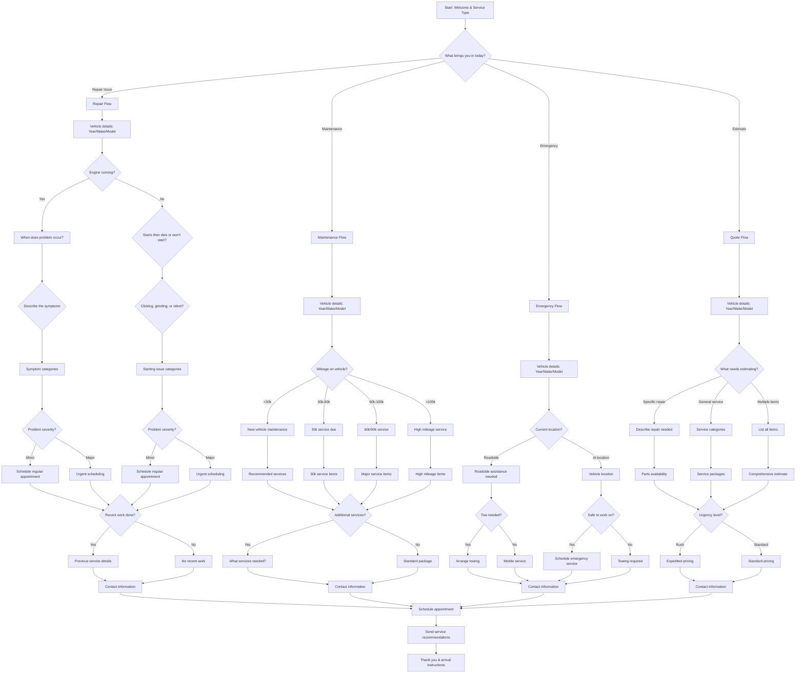

# Automotive Repair Shop Service Request - Interactive Voice Workflow

This script is designed for automotive repair shops to gather detailed vehicle information and symptoms from customers through an interactive voice workflow on their website. It uses **branching logic** to categorize issues and schedule appropriate service.

---

---

## Step Scripts

### A - Start: Welcome & Service Type
**Voice Script:** Welcome to [Auto Shop Name]! I'm here to help diagnose your vehicle issue or schedule service. What brings you in today?

### B - What brings you in today?
**Voice Script:** Great! We handle repairs, maintenance, emergency situations, and estimates. How can we help you today?

### R - Repair Flow
**Voice Script:** Sorry to hear you're having vehicle trouble. Let's gather details so our technicians can diagnose the issue properly.

### R1 - Vehicle details
**Voice Script:** Let's start with your vehicle information. What's the year, make, and model?

### R2 - Engine running?
**Voice Script:** Is your engine currently running, or is it not starting at all?

### R3 - When does problem occur?
**Voice Script:** When does the problem occur? While driving, at startup, when accelerating, or at specific speeds?

### R4 - Starts then dies or won't start?
**Voice Script:** Does it start and then immediately die, or won't it start at all?

### R5 - Describe the symptoms
**Voice Script:** Can you describe what's happening? Any unusual noises, lights, smells, or handling issues?

### R6 - Clicking, grinding, or silent?
**Voice Script:** When you try to start it, do you hear clicking, grinding, or is it completely silent?

### R7 - Symptom categories
**Voice Script:** Based on your description, this sounds like a [engine/transmission/brakes/suspension] issue. Our technicians specialize in these repairs.

### R8 - Starting issue categories
**Voice Script:** This sounds like a [battery/alternator/starter/fuel system] problem. We can diagnose this quickly.

### R9 - Problem severity?
**Voice Script:** How severe is the problem? Is it getting worse, or is it unsafe to drive?

### R10 - Problem severity?
**Voice Script:** How urgent is the starting issue? Are you stranded or can you get here safely?

### R11 - Schedule regular appointment
**Voice Script:** This sounds manageable. Let's schedule you for our next available appointment.

### R12 - Urgent scheduling
**Voice Script:** This sounds serious. We should get you in as soon as possible.

### R13 - Schedule regular appointment
**Voice Script:** Starting issues can often be fixed quickly. Let's get you scheduled.

### R14 - Urgent scheduling
**Voice Script:** Not starting at all needs immediate attention. Let's get you in today.

### R15 - Recent work done?
**Voice Script:** Has any recent work been done on the vehicle?

### R16 - Previous service details
**Voice Script:** Can you tell me about the recent work? This helps our diagnosis.

### R17 - No recent work
**Voice Script:** No recent work noted. We'll perform a complete diagnosis.

### R18 - Contact information
**Voice Script:** Perfect! Let me get your contact information to schedule your service appointment.

### M - Maintenance Flow
**Voice Script:** Regular maintenance keeps your vehicle running smoothly. Let's check what services are due.

### M1 - Vehicle details
**Voice Script:** What's the year, make, and model of your vehicle?

### M2 - Mileage on vehicle?
**Voice Script:** What's the current mileage on your vehicle?

### M3 - New vehicle maintenance
**Voice Script:** For newer vehicles, we recommend basic maintenance and inspections.

### M4 - 30k service due
**Voice Script:** At 30k miles, several important services are typically due.

### M5 - 60k/90k service
**Voice Script:** This mileage range includes major service intervals.

### M6 - High mileage service
**Voice Script:** High mileage vehicles need specialized care and attention.

### M7 - Recommended services
**Voice Script:** For your vehicle, we recommend: oil change, tire rotation, and multi-point inspection.

### M8 - 30k service items
**Voice Script:** At 30k miles, you typically need: oil change, air filter, cabin filter, and brake inspection.

### M9 - Major service items
**Voice Script:** Major service typically includes: timing belt, transmission service, and cooling system service.

### M10 - High mileage items
**Voice Script:** For high mileage, we recommend: engine diagnostics, suspension check, and preventive maintenance.

### M11 - Additional services?
**Voice Script:** Are there any additional services or concerns you'd like us to address?

### M12 - What services needed?
**Voice Script:** What additional services are you interested in?

### M13 - Standard package
**Voice Script:** We'll focus on the standard maintenance package for your mileage.

### M14 - Contact information
**Voice Script:** Great! Let me get your contact information to schedule your maintenance appointment.

### E - Emergency Flow
**Voice Script:** I'm sorry you're dealing with an emergency situation. Let's get you help right away.

### E1 - Vehicle details
**Voice Script:** What's the year, make, and model? This helps us prepare the right tools and parts.

### E2 - Current location?
**Voice Script:** Where is your vehicle currently located?

### E3 - Roadside assistance needed
**Voice Script:** We can arrange roadside assistance or mobile service to get you going.

### E4 - Vehicle location
**Voice Script:** Can you tell me exactly where your vehicle is located?

### E5 - Tow needed?
**Voice Script:** Does the vehicle need to be towed, or can it be driven with assistance?

### E6 - Safe to work on?
**Voice Script:** Is the vehicle in a safe location where our technicians can work?

### E7 - Arrange towing
**Voice Script:** We'll arrange towing to our facility immediately.

### E8 - Mobile service
**Voice Script:** We can send a mobile technician to your location.

### E9 - Schedule emergency service
**Voice Script:** We'll get a technician to you as soon as possible.

### E10 - Towing required
**Voice Script:** For safety reasons, we'll need to tow the vehicle to our shop.

### E11 - Contact information
**Voice Script:** Let me get your contact information so we can coordinate emergency service.

### Q - Quote Flow
**Voice Script:** We'd be happy to provide an estimate for your vehicle needs. Let's gather the details.

### Q1 - Vehicle details
**Voice Script:** What's the year, make, and model of the vehicle?

### Q2 - What needs estimating?
**Voice Script:** What type of work needs an estimate?

### Q3 - Describe repair needed
**Voice Script:** Can you describe the specific repair that's needed?

### Q4 - Service categories
**Voice Script:** What category of service are you interested in estimating?

### Q5 - List all items
**Voice Script:** Can you list all the items that need attention?

### Q6 - Parts availability
**Voice Script:** For this repair, parts are typically available. We'll provide a detailed estimate.

### Q7 - Service packages
**Voice Script:** We can provide estimates for various service packages.

### Q8 - Comprehensive estimate
**Voice Script:** We'll prepare a comprehensive estimate covering all the items you mentioned.

### Q9 - Urgency level?
**Voice Script:** How urgent is this work? Does it need to be done immediately?

### Q10 - Expedited pricing
**Voice Script:** For rush jobs, there may be expedited service fees.

### Q11 - Standard pricing
**Voice Script:** We'll provide standard pricing with our normal turnaround times.

### Q12 - Contact information
**Voice Script:** Perfect! Let me get your contact information to send your detailed estimate.

### Z - Schedule appointment
**Voice Script:** Based on what you've described, we can get you scheduled. What day works best for you?

### Z1 - Send service recommendations
**Voice Script:** I'll send you service recommendations and pricing information via email or text.

### END - Thank you & arrival instructions
**Voice Script:** Thank you for choosing [Auto Shop Name]! You'll receive confirmation with arrival instructions and what to bring. See you soon!
