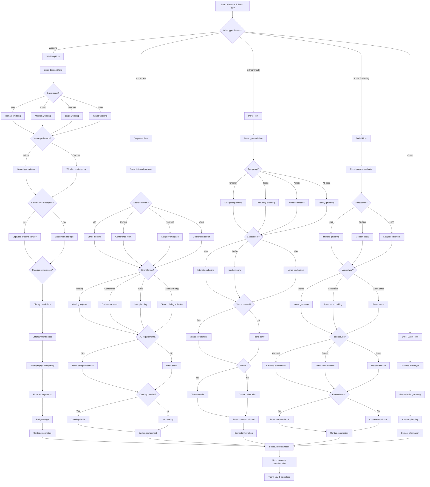

# Event Planning Client Consultation - Interactive Voice Workflow

This script is designed for event planning businesses to gather essential event details and requirements from potential clients through an interactive voice workflow on their website. It uses **branching logic** to collect structured information for comprehensive event planning.

---

---

## Step Scripts

### A - Start: Welcome & Event Type
**Voice Script:** Welcome to [Event Planning Company Name]! I'm here to help bring your vision to life. What type of event are you planning?

### B - What type of event?
**Voice Script:** Wonderful! We specialize in weddings, corporate events, birthday parties, social gatherings, and custom celebrations. What are you planning?

### W - Wedding Flow
**Voice Script:** Congratulations on your engagement! Weddings are our specialty. Let's create your perfect day together.

### W1 - Event date and time
**Voice Script:** What's your wedding date and preferred ceremony time? This helps us check availability.

### W2 - Guest count?
**Voice Script:** How many guests are you expecting? This affects venue choices and pricing.

### W3 - Intimate wedding
**Voice Script:** An intimate wedding sounds romantic! We can focus on personalized touches.

### W4 - Medium wedding
**Voice Script:** A medium-sized wedding gives us great flexibility for beautiful celebrations.

### W5 - Large wedding
**Voice Script:** Large weddings are spectacular! We have experience with grand celebrations.

### W6 - Grand wedding
**Voice Script:** Grand weddings require exceptional planning. We love creating unforgettable experiences!

### W7 - Venue preference?
**Voice Script:** Do you prefer an indoor or outdoor venue for your wedding?

### W8 - Venue type options
**Voice Script:** Indoor venues offer great flexibility. Would you prefer a ballroom, garden room, or historic building?

### W9 - Weather contingency
**Voice Script:** Outdoor weddings are beautiful! We'll include weather contingency plans.

### W10 - Ceremony + Reception?
**Voice Script:** Are you planning both a ceremony and reception?

### W11 - Separate or same venue?
**Voice Script:** Would you like the ceremony and reception at the same venue or different locations?

### W12 - Elopement package
**Voice Script:** Elopements can be intimate and romantic. We offer beautiful elopement packages.

### W13 - Catering preferences?
**Voice Script:** What type of catering are you considering? Buffet, plated, food stations, or family-style?

### W14 - Dietary restrictions
**Voice Script:** Do you or your guests have any dietary restrictions or preferences?

### W15 - Entertainment needs
**Voice Script:** What entertainment are you considering? DJ, live band, photo booth, or other activities?

### W16 - Photography/videography
**Voice Script:** Would you like photography, videography, or both to capture your special day?

### W17 - Floral arrangements
**Voice Script:** What floral style appeals to you? Traditional, modern, wildflower, or seasonal?

### W18 - Budget range
**Voice Script:** What's your budget range for the wedding? This helps us recommend appropriate options.

### W19 - Contact information
**Voice Script:** Perfect! Let me get your contact information to send detailed wedding planning options.

### C - Corporate Flow
**Voice Script:** Corporate events help build team spirit and company culture. Let's make yours successful.

### C1 - Event date and purpose
**Voice Script:** What's the date and purpose of your corporate event? This helps us plan appropriately.

### C2 - Attendee count?
**Voice Script:** How many attendees are you expecting?

### C3 - Small meeting
**Voice Script:** Small meetings are great for focused discussions and team building.

### C4 - Conference room
**Voice Script:** Conference room settings work well for presentations and workshops.

### C5 - Large event space
**Voice Script:** Large event spaces accommodate conferences and company-wide gatherings.

### C6 - Convention center
**Voice Script:** Convention centers are perfect for large-scale corporate events and exhibitions.

### C7 - Event format?
**Voice Script:** What format will your event take?

### C8 - Meeting logistics
**Voice Script:** We'll handle all the meeting logistics from setup to execution.

### C9 - Conference setup
**Voice Script:** Conferences require careful planning for speakers, sessions, and networking.

### C10 - Gala planning
**Voice Script:** Galas combine elegance with entertainment for memorable company events.

### C11 - Team building activities
**Voice Script:** Team building events strengthen relationships and boost morale.

### C12 - AV requirements?
**Voice Script:** Do you need audio-visual equipment or presentation technology?

### C13 - Technical specifications
**Voice Script:** What technical equipment do you need? Projectors, microphones, lighting, staging?

### C14 - Basic setup
**Voice Script:** We'll provide basic setup with tables, chairs, and refreshments.

### C15 - Catering needed?
**Voice Script:** Would you like catering for your event?

### C16 - Catering details
**Voice Script:** What type of catering would you prefer? Breakfast, lunch, breaks, or full service?

### C17 - No catering
**Voice Script:** No catering needed. We'll focus on the event logistics.

### C18 - Budget and contact
**Voice Script:** What's your budget range? Let me get your contact information for detailed proposals.

### P - Party Flow
**Voice Script:** Parties should be fun and memorable! Let's plan an amazing celebration.

### P1 - Event type and date
**Voice Script:** What's the occasion and date for your party?

### P2 - Age group?
**Voice Script:** Who's the main age group for this party?

### P3 - Kids party planning
**Voice Script:** Kids parties are all about fun! We can include games, entertainment, and kid-friendly activities.

### P4 - Teen party planning
**Voice Script:** Teen parties balance fun with appropriate supervision and activities.

### P5 - Adult celebration
**Voice Script:** Adult celebrations can range from elegant to casual fun.

### P6 - Family gathering
**Voice Script:** Family gatherings bring everyone together for memorable occasions.

### P7 - Guest count?
**Voice Script:** How many guests are you expecting?

### P8 - Intimate gathering
**Voice Script:** Intimate gatherings allow for personal connections and meaningful celebrations.

### P9 - Medium party
**Voice Script:** Medium parties give us flexibility for great entertainment options.

### P10 - Large celebration
**Voice Script:** Large celebrations need careful planning but create amazing memories!

### P11 - Venue needed?
**Voice Script:** Do you need us to find and book a venue?

### P12 - Venue preferences
**Voice Script:** What type of venue are you looking for? Restaurant, park, event hall, or other?

### P13 - Home party
**Voice Script:** Home parties can be cozy and personal. We'll help decorate and organize.

### P14 - Theme?
**Voice Script:** Do you have a theme in mind for the party?

### P15 - Theme details
**Voice Script:** Tell me about your theme! Colors, decorations, activities, costumes?

### P16 - Casual celebration
**Voice Script:** No theme needed - we'll focus on making it fun and festive.

### P17 - Entertainment and food
**Voice Script:** What entertainment and food would you like? Music, games, catering preferences?

### P18 - Contact information
**Voice Script:** Sounds like a great party! Let me get your contact information for planning details.

### S - Social Flow
**Voice Script:** Social gatherings bring people together. Let's make yours special.

### S1 - Event purpose and date
**Voice Script:** What's the purpose and date of your social gathering?

### S2 - Guest count?
**Voice Script:** How many people are you expecting?

### S3 - Intimate gathering
**Voice Script:** Intimate gatherings allow for meaningful connections.

### S4 - Medium social
**Voice Script:** Medium social events balance intimacy with broader connections.

### S5 - Large social event
**Voice Script:** Large social events create buzz and bring communities together.

### S6 - Venue type?
**Voice Script:** What type of venue are you considering?

### S7 - Home gathering
**Voice Script:** Home gatherings are warm and welcoming. We'll help you prepare.

### S8 - Restaurant booking
**Voice Script:** Restaurants offer convenience with professional service.

### S9 - Event venue
**Voice Script:** Event venues provide space and amenities for larger gatherings.

### S10 - Food service?
**Voice Script:** How would you like to handle food for your event?

### S11 - Catering preferences
**Voice Script:** What type of catering appeals to you? Full service, buffet, appetizers?

### S12 - Potluck coordination
**Voice Script:** Potlucks are fun and casual. We'll help coordinate contributions.

### S13 - No food service
**Voice Script:** No food service needed. We'll focus on the event coordination.

### S14 - Entertainment?
**Voice Script:** Would you like entertainment for your gathering?

### S15 - Entertainment details
**Voice Script:** What entertainment are you considering? Music, games, activities?

### S16 - Conversation focus
**Voice Script:** Sometimes the best entertainment is great conversation!

### S17 - Contact information
**Voice Script:** Perfect! Let me get your contact information to start planning your social event.

### O - Other Event Flow
**Voice Script:** We love unique events! Tell me about what you're planning.

### O1 - Describe event type
**Voice Script:** Can you describe the type of event you're planning?

### O2 - Event details gathering
**Voice Script:** Let's gather the key details for your custom event.

### O3 - Custom planning
**Voice Script:** We'll create a custom plan tailored to your unique event.

### O4 - Contact information
**Voice Script:** Great! Let me get your contact information for your custom event planning.

### Z - Schedule consultation
**Voice Script:** Based on your event details, I'd like to schedule a consultation to discuss options and create a detailed plan.

### Z1 - Send planning questionnaire
**Voice Script:** I'll send you a detailed planning questionnaire to capture all the specifics.

### END - Thank you & next steps
**Voice Script:** Thank you for sharing your event vision! You'll receive planning materials shortly. We're excited to help make your event unforgettable!
