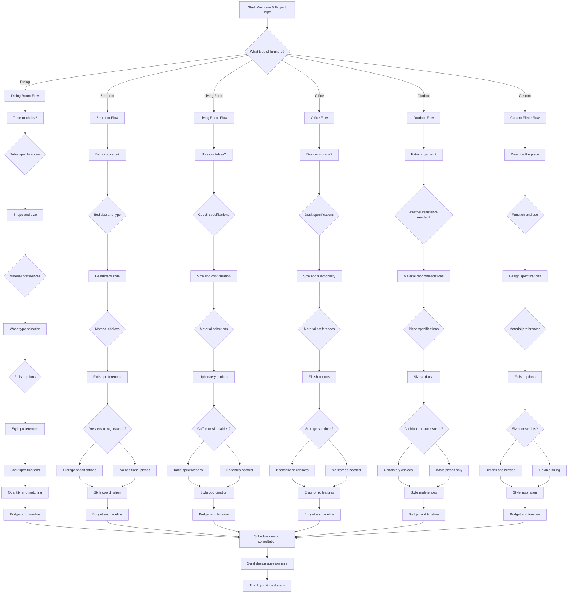

# Custom Furniture Maker Design Consultation - Interactive Voice Workflow

This script is designed for custom furniture makers to gather detailed specifications and design preferences from potential clients through an interactive voice workflow on their website. It uses **branching logic** to create structured design briefs for custom pieces.

---

---

## Step Scripts

### A - Start: Welcome & Project Type
**Voice Script:** Welcome to [Furniture Maker Name]! I'm here to help design your perfect custom furniture piece. What room or type of furniture are you interested in?

### B - What type of furniture?
**Voice Script:** Excellent! We create custom pieces for every room. What type of furniture project are you envisioning?

### D - Dining Room Flow
**Voice Script:** Dining room furniture should be both beautiful and functional. Let's design pieces that will serve your family for years.

### D1 - Table or chairs?
**Voice Script:** Are you looking for a dining table, chairs, or both?

### D2 - Table specifications
**Voice Script:** Let's design your perfect dining table. Size and shape are important for family gatherings.

### D3 - Shape and size
**Voice Script:** What shape and size table are you considering? Rectangle, round, square? How many people should it seat?

### D4 - Material preferences
**Voice Script:** What material appeals to you? Solid wood offers durability, while wood veneers can be more affordable.

### D5 - Wood type selection
**Voice Script:** What wood type interests you? Oak, maple, walnut, cherry, or something more exotic?

### D6 - Finish options
**Voice Script:** What finish would you prefer? Natural stain, painted, distressed, or high-gloss?

### D7 - Style preferences
**Voice Script:** What style are you drawn to? Traditional, contemporary, rustic, or transitional?

### D8 - Chair specifications
**Voice Script:** For the chairs, do you prefer upholstered seats, wooden seats, or a mix? With or without arms?

### D9 - Quantity and matching
**Voice Script:** How many chairs do you need, and should they match the table finish perfectly?

### D10 - Budget and timeline
**Voice Script:** What's your budget range and timeline for this dining set?

### BR - Bedroom Flow
**Voice Script:** Your bedroom should be a peaceful retreat. Let's create furniture that enhances your space.

### BR1 - Bed or storage?
**Voice Script:** Are you looking for a bed, storage pieces like dressers, or both?

### BR2 - Bed size and type
**Voice Script:** What size bed do you need? Queen, king, or California king? Platform, sleigh, or panel style?

### BR3 - Headboard style
**Voice Script:** What style headboard appeals to you? Upholstered, wooden, tufted, or minimal?

### BR4 - Material choices
**Voice Script:** What materials would you like for your bed? Wood, metal, upholstered, or mixed materials?

### BR5 - Finish preferences
**Voice Script:** What finish works best with your bedroom decor?

### BR6 - Dressers or nightstands?
**Voice Script:** Would you like matching dressers or nightstands to complete the bedroom set?

### BR7 - Storage specifications
**Voice Script:** What storage needs do you have? Drawers, doors, jewelry trays, or media storage?

### BR8 - No additional pieces
**Voice Script:** Just the bed then. We'll focus on making it perfect.

### BR9 - Style coordination
**Voice Script:** Should all pieces coordinate in style and finish, or can they have complementary differences?

### BR10 - Budget and timeline
**Voice Script:** What's your budget and when would you like your bedroom furniture completed?

### LR - Living Room Flow
**Voice Script:** Living room furniture sets the tone for your home. Let's create comfortable, stylish pieces.

### LR1 - Sofas or tables?
**Voice Script:** Are you looking for seating like sofas, or accent tables, or both?

### LR2 - Couch specifications
**Voice Script:** Let's design your sofa. Size and style are key for comfortable living.

### LR3 - Size and configuration
**Voice Script:** What size sofa? Loveseat, sofa, sectional? Left-arm facing, right-arm facing, or armless?

### LR4 - Material selections
**Voice Script:** What frame material? Wood, metal, or mixed? And for cushions?

### LR5 - Upholstery choices
**Voice Script:** What upholstery material? Fabric, leather, microfiber, or performance fabric?

### LR6 - Coffee or side tables?
**Voice Script:** Would you like coffee tables or side tables to complement your sofa?

### LR7 - Table specifications
**Voice Script:** What style tables? Modern, traditional, rustic? With storage or open shelving?

### LR8 - No tables needed
**Voice Script:** Just the sofa then. We'll make it the perfect centerpiece.

### LR9 - Style coordination
**Voice Script:** Should the tables match the sofa style, or provide contrast?

### LR10 - Budget and timeline
**Voice Script:** What's your budget range and preferred timeline for your living room furniture?

### O - Office Flow
**Voice Script:** A well-designed workspace improves productivity. Let's create functional, beautiful office furniture.

### O1 - Desk or storage?
**Voice Script:** Are you looking for a desk, storage solutions, or both?

### O2 - Desk specifications
**Voice Script:** Let's design your workspace. Size and functionality matter for productivity.

### O3 - Size and functionality
**Voice Script:** What size desk? Writing desk, executive desk, or corner unit? Do you need space for multiple monitors?

### O4 - Material preferences
**Voice Script:** What materials work for your office? Wood, metal, glass, or combinations?

### O5 - Finish options
**Voice Script:** What finish would suit your office environment?

### O6 - Storage solutions?
**Voice Script:** Do you need storage solutions like bookshelves, file cabinets, or credenzas?

### O7 - Bookcase or cabinets
**Voice Script:** What type of storage? Open shelving, enclosed cabinets, or lateral files?

### O8 - No storage needed
**Voice Script:** Just the desk then. We'll focus on making it perfect for your work.

### O9 - Ergonomic features
**Voice Script:** Any ergonomic features needed? Keyboard trays, cable management, adjustable height?

### O10 - Budget and timeline
**Voice Script:** What's your budget and when do you need your office furniture?

### OD - Outdoor Flow
**Voice Script:** Outdoor furniture must withstand the elements. Let's create beautiful, durable pieces for your space.

### OD1 - Patio or garden?
**Voice Script:** Is this for a patio, deck, or garden area?

### OD2 - Weather resistance needed?
**Voice Script:** Will this furniture be exposed to weather year-round, or stored in winter?

### OD3 - Material recommendations
**Voice Script:** For weather resistance, we recommend teak, eucalyptus, wrought iron, or powder-coated aluminum.

### OD4 - Piece specifications
**Voice Script:** What pieces do you need? Dining set, lounge chairs, sectional, or bar set?

### OD5 - Size and use
**Voice Script:** How many people should it accommodate, and what's the primary use?

### OD6 - Cushions or accessories?
**Voice Script:** Would you like cushions, pillows, or other accessories?

### OD7 - Upholstery choices
**Voice Script:** What fabric would you prefer? Sunbrella, acrylic, or solution-dyed?

### OD8 - Basic pieces only
**Voice Script:** Just the furniture frames then. We can always add cushions later.

### OD9 - Style preferences
**Voice Script:** What style appeals to you? Traditional, contemporary, rustic, or coastal?

### OD10 - Budget and timeline
**Voice Script:** What's your budget and when would you like your outdoor furniture?

### C - Custom Piece Flow
**Voice Script:** Custom pieces are our specialty! Tell me about your unique vision.

### C1 - Describe the piece
**Voice Script:** Can you describe the custom piece you have in mind?

### C2 - Function and use
**Voice Script:** What will this piece be used for? Storage, display, seating, or something else?

### C3 - Design specifications
**Voice Script:** Let's talk about the design. Any sketches, inspiration photos, or specific requirements?

### C4 - Material preferences
**Voice Script:** What materials would you like to use for this custom piece?

### C5 - Finish options
**Voice Script:** What finish would work best for your piece?

### C6 - Size constraints?
**Voice Script:** Are there any size constraints or space limitations we need to consider?

### C7 - Dimensions needed
**Voice Script:** What are the required dimensions for this piece?

### C8 - Flexible sizing
**Voice Script:** No size constraints noted. We can work within your space.

### C9 - Style inspiration
**Voice Script:** What style or aesthetic inspires you for this piece?

### C10 - Budget and timeline
**Voice Script:** What's your budget range and timeline for this custom project?

### Z - Schedule design consultation
**Voice Script:** Based on your requirements, I'd like to schedule a virtual design consultation to refine these details.

### Z1 - Send design questionnaire
**Voice Script:** I'll send you a detailed design questionnaire and some inspiration photos based on your preferences.

### END - Thank you & next steps
**Voice Script:** Thank you for sharing your furniture vision! You'll receive design materials shortly. We're excited to create something beautiful for you!
