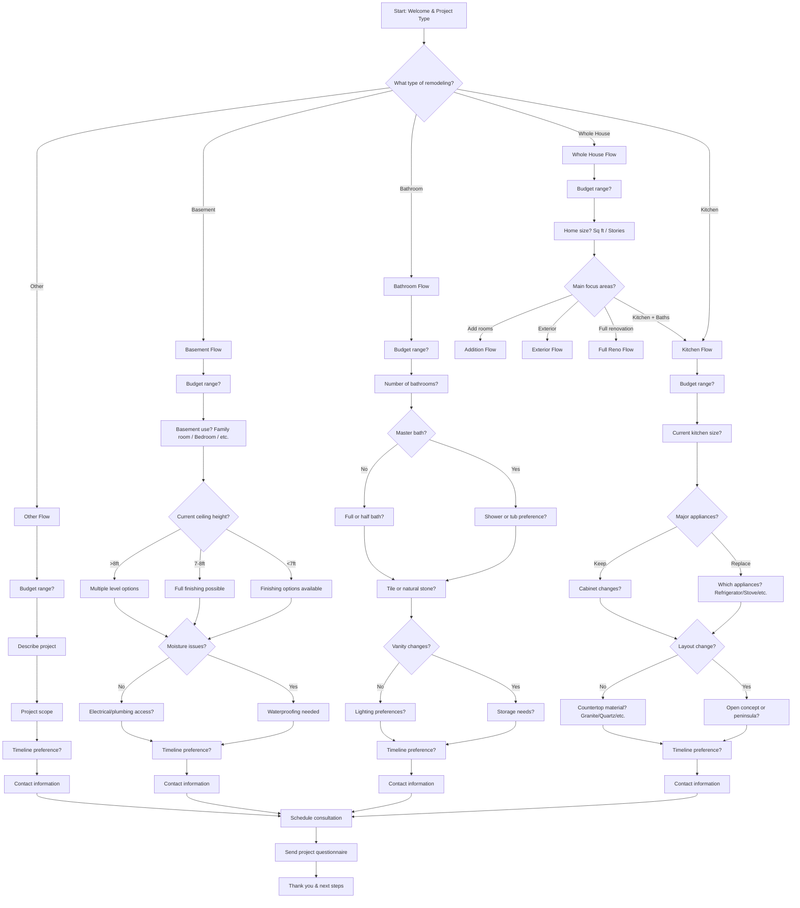

# Home Remodeling Contractor Lead Generation - Interactive Voice Workflow

This script is designed for a home remodeling contractor to gather essential project details from potential clients through an interactive voice workflow on their website. It uses **branching logic** based on client responses to qualify leads and collect structured project information.

---

---

## Step Scripts

### A - Start: Welcome & Project Type
**Voice Script:** Welcome to [Company Name]! I'm here to help you plan your remodeling project. What type of remodeling are you interested in?

### B - What type of remodeling?
**Voice Script:** Great! We specialize in kitchen renovations, bathroom remodels, basement finishing, whole house projects, and custom work. Which best describes what you're looking for?

### K - Kitchen Flow
**Voice Script:** Excellent! Kitchen remodeling is one of our specialties. Let's gather some details to help us create the perfect design for you.

### K1 - Budget range?
**Voice Script:** What's your approximate budget range for this kitchen project? We can work with budgets from $15,000 to $150,000+.

### K2 - Current kitchen size?
**Voice Script:** What's the current size of your kitchen? This helps us understand the scope of work needed.

### K3 - Major appliances?
**Voice Script:** Are you planning to replace any major appliances like the refrigerator, stove, or dishwasher?

### K4 - Which appliances?
**Voice Script:** Which appliances would you like to replace? This helps us plan the electrical and plumbing work.

### K5 - Cabinet changes?
**Voice Script:** Are you looking to change the cabinet layout, style, or just refresh the existing ones?

### K6 - Layout change?
**Voice Script:** Would you like to change the kitchen layout? Maybe create an open concept or add a peninsula?

### K7 - Open concept or peninsula?
**Voice Script:** Would you prefer an open concept design or adding a peninsula for additional workspace?

### K8 - Countertop material?
**Voice Script:** What countertop material are you considering? Granite, quartz, butcher block, or something else?

### K9 - Timeline preference?
**Voice Script:** What's your preferred timeline for completion? We typically work on 4-12 week schedules.

### K10 - Contact information
**Voice Script:** Perfect! To send you detailed options and schedule a free consultation, may I have your name and email address?

### BA - Bathroom Flow
**Voice Script:** Bathroom remodeling can transform your space! Let's discuss your vision.

### BA1 - Budget range?
**Voice Script:** What's your budget range for the bathroom project? We handle everything from simple updates to luxury spa-like bathrooms.

### BA2 - Number of bathrooms?
**Voice Script:** How many bathrooms are you planning to remodel?

### BA3 - Master bath?
**Voice Script:** Is one of these the master bathroom? That opens up more luxury options.

### BA4 - Shower or tub preference?
**Voice Script:** For the master bath, would you prefer a walk-in shower, tub/shower combo, or freestanding tub?

### BA5 - Full or half bath?
**Voice Script:** Are these full bathrooms or half baths? This affects the plumbing requirements.

### BA6 - Tile or natural stone?
**Voice Script:** What are you thinking for flooring and walls? Tile, natural stone, or another material?

### BA7 - Vanity changes?
**Voice Script:** Are you planning to update the vanities or keep the existing ones?

### BA8 - Storage needs?
**Voice Script:** Do you need additional storage solutions like linen closets or built-in cabinets?

### BA9 - Lighting preferences?
**Voice Script:** What style of lighting are you interested in? Modern, traditional, or transitional?

### BA10 - Timeline preference?
**Voice Script:** What's your ideal timeline? Bathroom projects typically take 2-6 weeks.

### BA11 - Contact information
**Voice Script:** Great details! Let me get your contact information so we can provide a personalized quote.

### BS - Basement Flow
**Voice Script:** Basement finishing can add valuable living space to your home. Let's explore your options.

### BS1 - Budget range?
**Voice Script:** What's your budget for the basement project? This helps us determine the scope and quality of finishes.

### BS2 - Basement use?
**Voice Script:** How do you plan to use the finished basement? Family room, home office, bedroom, or recreation space?

### BS3 - Current ceiling height?
**Voice Script:** What's the current ceiling height in your basement? This affects finishing options.

### BS4 - Finishing options available
**Voice Script:** With lower ceilings, we can still create a great space with proper planning and lighting.

### BS5 - Full finishing possible
**Voice Script:** Perfect ceiling height for a full basement finish with plenty of options!

### BS6 - Multiple level options
**Voice Script:** High ceilings give us great flexibility for multi-level designs or volume ceilings.

### BS7 - Moisture issues?
**Voice Script:** Have you noticed any moisture, water, or humidity issues in the basement?

### BS8 - Waterproofing needed
**Voice Script:** We'll include proper waterproofing and drainage solutions to protect your investment.

### BS9 - Electrical/plumbing access?
**Voice Script:** Do you have existing electrical and plumbing access, or will we need to add those?

### BS10 - Timeline preference?
**Voice Script:** Basement projects typically take 6-12 weeks. What's your preferred timeline?

### BS11 - Contact information
**Voice Script:** Excellent! Let's get you connected with our design specialist.

### WH - Whole House Flow
**Voice Script:** Whole house remodeling is a big project! Let's break this down into manageable pieces.

### WH1 - Budget range?
**Voice Script:** What's your total budget for the whole house project? This helps us prioritize and plan phases.

### WH2 - Home size?
**Voice Script:** What's the square footage of your home and how many stories?

### WH3 - Main focus areas?
**Voice Script:** Which areas are the main focus? Kitchen and bathrooms, adding rooms, exterior work, or full renovation?

### O - Other Flow
**Voice Script:** Tell me about your custom remodeling project. We're experienced in many types of renovations.

### O1 - Budget range?
**Voice Script:** What's your approximate budget for this project?

### O2 - Describe project
**Voice Script:** Can you describe the project you'd like to undertake?

### O3 - Project scope
**Voice Script:** Based on your description, this sounds like a [size/scope] project. Is that accurate?

### O4 - Timeline preference?
**Voice Script:** What's your preferred timeline for this work?

### O5 - Contact information
**Voice Script:** Perfect! Let me get your contact info so we can discuss this further.

### Z - Schedule consultation
**Voice Script:** Based on what you've shared, I'd like to schedule a free consultation to see your space and provide detailed options.

### Z1 - Send project questionnaire
**Voice Script:** I'll send you a detailed project questionnaire and some inspiration photos based on your preferences.

### END - Thank you & next steps
**Voice Script:** Thank you for sharing your project details! You'll receive an email shortly with next steps. We're excited to help bring your vision to life!
