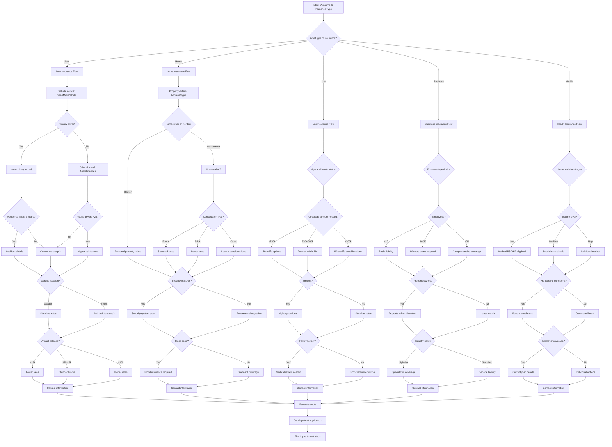

# Insurance Agency Quote Generation - Interactive Voice Workflow

This script is designed for insurance agencies to gather essential coverage information from potential clients through an interactive voice workflow on their website. It uses **branching logic** to determine coverage needs and risk factors for accurate quotes.

---

---

## Step Scripts

### A - Start: Welcome & Insurance Type
**Voice Script:** Welcome to [Insurance Agency Name]! I'm here to help you find the right insurance coverage. What type of insurance are you looking for?

### B - What type of insurance?
**Voice Script:** Great! We offer auto, home, life, business, and health insurance. Which one interests you today?

### AU - Auto Insurance Flow
**Voice Script:** Auto insurance protects what matters most. Let's get the details for your personalized quote.

### AU1 - Vehicle details
**Voice Script:** Let's start with your vehicle information. What's the year, make, and model?

### AU2 - Primary driver?
**Voice Script:** Are you the primary driver of this vehicle?

### AU3 - Your driving record
**Voice Script:** What's your driving record like? Any tickets or accidents in the last 3 years?

### AU4 - Other drivers?
**Voice Script:** Who else drives this vehicle? Their ages and license status?

### AU5 - Accidents in last 3 years?
**Voice Script:** Have there been any accidents involving this vehicle in the last 3 years?

### AU6 - Young drivers <25?
**Voice Script:** Are there any drivers under 25 years old?

### AU7 - Accident details
**Voice Script:** Can you tell me about the accident? Who was at fault and what were the damages?

### AU8 - Current coverage?
**Voice Script:** Do you currently have auto insurance? If so, what's your current premium?

### AU9 - Higher risk factors
**Voice Script:** Young drivers can increase premiums, but we have options to help manage costs.

### AU10 - Garage location?
**Voice Script:** Is your vehicle typically garaged or parked on the street?

### AU11 - Standard rates
**Voice Script:** Garage parking usually qualifies for our best rates!

### AU12 - Anti-theft features?
**Voice Script:** Does your vehicle have anti-theft features like an alarm or GPS tracking?

### AU13 - Annual mileage?
**Voice Script:** What's your estimated annual mileage?

### AU14 - Lower rates
**Voice Script:** Low mileage drivers often qualify for our lowest rates!

### AU15 - Standard rates
**Voice Script:** Average mileage - we'll find you competitive rates.

### AU16 - Higher rates
**Voice Script:** Higher mileage increases risk, which affects premiums, but we can still find good coverage.

### AU17 - Contact information
**Voice Script:** Perfect! Let me get your contact information so I can send you personalized quotes.

### HO - Home Insurance Flow
**Voice Script:** Home insurance protects your biggest investment. Let's find the right coverage for you.

### HO1 - Property details
**Voice Script:** What's your property address and type of home? House, condo, or townhome?

### HO2 - Homeowner or Renter?
**Voice Script:** Are you a homeowner or renter?

### HO3 - Home value?
**Voice Script:** What's the estimated value of your home?

### HO4 - Personal property value
**Voice Script:** What's the value of your personal property and belongings?

### HO5 - Construction type?
**Voice Script:** What's the primary construction material of your home?

### HO6 - Standard rates
**Voice Script:** Frame construction is common and has standard rates available.

### HO7 - Lower rates
**Voice Script:** Brick construction often qualifies for lower rates due to better durability.

### HO8 - Special considerations
**Voice Script:** Some construction types may require additional underwriting review.

### HO9 - Security features?
**Voice Script:** Does your home have security features like alarms, cameras, or reinforced doors?

### HO10 - Security system type
**Voice Script:** What type of security system do you have? This can qualify you for discounts.

### HO11 - Recommend upgrades
**Voice Script:** We can recommend cost-effective security upgrades that also lower your premiums.

### HO12 - Flood zone?
**Voice Script:** Is your property located in a flood zone?

### HO13 - Flood insurance required
**Voice Script:** Flood zones require separate flood insurance. We can help you get that too.

### HO14 - Standard coverage
**Voice Script:** Great! No flood zone concerns for standard home insurance.

### HO15 - Contact information
**Voice Script:** Excellent! Let me get your contact details for your personalized home insurance quote.

### LI - Life Insurance Flow
**Voice Script:** Life insurance provides peace of mind for your loved ones. Let's find the right coverage.

### LI1 - Age and health status
**Voice Script:** What's your age and general health status? This helps determine your eligibility.

### LI2 - Coverage amount needed?
**Voice Script:** How much life insurance coverage are you looking for?

### LI3 - Term life options
**Voice Script:** Term life insurance offers affordable coverage for specific time periods.

### LI4 - Term or whole life
**Voice Script:** You could consider either term life for pure protection or whole life for permanent coverage.

### LI5 - Whole life considerations
**Voice Script:** Higher coverage amounts often work best with whole life or universal life policies.

### LI6 - Smoker?
**Voice Script:** Do you use tobacco products? This affects your rates.

### LI7 - Higher premiums
**Voice Script:** Smoking does increase premiums, but we have options for all lifestyles.

### LI8 - Standard rates
**Voice Script:** Non-smokers typically qualify for our best rates!

### LI9 - Family history?
**Voice Script:** Do you have any significant health conditions or family history of serious illness?

### LI10 - Medical review needed
**Voice Script:** Some health factors require additional medical underwriting, but many conditions are still insurable.

### LI11 - Simplified underwriting
**Voice Script:** With good health, you may qualify for simplified underwriting processes.

### LI12 - Contact information
**Voice Script:** Perfect! Let me get your contact information for your life insurance options.

### BU - Business Insurance Flow
**Voice Script:** Business insurance protects your livelihood. Let's find the right coverage for your business.

### BU1 - Business type & size
**Voice Script:** What's your business type and approximate annual revenue?

### BU2 - Employees?
**Voice Script:** How many employees do you have?

### BU3 - Basic liability
**Voice Script:** Small businesses often start with general liability and property insurance.

### BU4 - Workers comp required
**Voice Script:** Most states require workers' compensation insurance for businesses with employees.

### BU5 - Comprehensive coverage
**Voice Script:** Larger businesses typically need comprehensive coverage including workers' comp, liability, and property.

### BU6 - Property owned?
**Voice Script:** Do you own the business property or lease it?

### BU7 - Property value & location
**Voice Script:** What's the property value and location? This affects property insurance rates.

### BU8 - Lease details
**Voice Script:** Can you tell me about your lease terms? Some leases require specific insurance coverage.

### BU9 - Industry risks?
**Voice Script:** Does your industry have unique risks? Like professional liability for consultants or equipment breakdown for manufacturers.

### BU10 - Specialized coverage
**Voice Script:** High-risk industries often need specialized coverage. We have solutions for most business types.

### BU11 - General liability
**Voice Script:** Standard business risks can be covered with general liability insurance.

### BU12 - Contact information
**Voice Script:** Great! Let me get your contact information for your business insurance quote.

### HE - Health Insurance Flow
**Voice Script:** Health insurance is essential for managing healthcare costs. Let's find options that work for you.

### HE1 - Household size & ages
**Voice Script:** How many people need coverage and what are their ages?

### HE2 - Income level?
**Voice Script:** What's your approximate household income? This affects subsidy eligibility.

### HE3 - Medicaid/SCHIP eligible?
**Voice Script:** Based on your income, you may qualify for Medicaid or SCHIP. Would you like information about those programs?

### HE4 - Subsidies available
**Voice Script:** Your income level may qualify you for premium subsidies through the marketplace.

### HE5 - Individual market
**Voice Script:** Higher income households can choose from all marketplace plans without subsidies.

### HE6 - Pre-existing conditions?
**Voice Script:** Do any household members have pre-existing health conditions?

### HE7 - Special enrollment
**Voice Script:** Pre-existing conditions may qualify you for special enrollment periods outside open enrollment.

### HE8 - Open enrollment
**Voice Script:** No pre-existing conditions means you can shop during regular open enrollment periods.

### HE9 - Employer coverage?
**Voice Script:** Does anyone have access to employer-sponsored health insurance?

### HE10 - Current plan details
**Voice Script:** Can you tell me about the current employer plan? We can compare it with marketplace options.

### HE11 - Individual options
**Voice Script:** Individual marketplace plans offer many choices and can be more affordable with subsidies.

### HE12 - Contact information
**Voice Script:** Perfect! Let me get your contact information to help you compare health insurance options.

### Z - Generate quote
**Voice Script:** Based on the information you've provided, I can generate personalized insurance quotes for you.

### Z1 - Send quote & application
**Voice Script:** I'll send you detailed quotes and application information via email.

### END - Thank you & next steps
**Voice Script:** Thank you for providing these details! You'll receive your personalized insurance quotes shortly. Feel free to reach out through our website with any questions!
