```mermaid
flowchart TD
    A[Start: Welcome & Issue Type] --> B{What's the problem?}
    B -- Computer/Device Issue --> C[Device Flow]
    B -- Network Issue --> N[Network Flow]
    B -- Software Issue --> S[Software Flow]
    B -- Security Issue --> SE[Security Flow]
    B -- Phone/Mobile Issue --> M[Mobile Flow]
    B -- Other Issue --> O[Other Flow]

    %% DEVICE FLOW
    C --> C1{Device type?}
    C1 -- Desktop --> C2[Desktop diagnostics]
    C1 -- Laptop --> C3[Laptop diagnostics]
    C1 -- Tablet --> C4[Tablet diagnostics]
    C2 & C3 & C4 --> C5{Power issue?}
    C5 -- Yes --> C6[Power troubleshooting]
    C5 -- No --> C7{Startup problem?}
    C6 --> C8[Power solutions]
    C7 -- Yes --> C9[Startup diagnostics]
    C7 -- No --> C10{Performance issue?}
    C8 & C9 --> C11[Tier 1 support]
    C10 -- Yes --> C12[Performance diagnostics]
    C10 -- No --> C13{Hardware failure?}
    C12 --> C14[Tier 2 support]
    C13 -- Yes --> C15[Hardware assessment]
    C13 -- No --> C16[Advanced diagnostics]
    C14 & C15 & C16 --> C17[Contact information]

    %% NETWORK FLOW
    N --> N1{Internet or WiFi?}
    N1 -- Internet --> N2[Internet diagnostics]
    N1 -- WiFi --> N3[WiFi diagnostics]
    N1 -- Both --> N4[Full network check]
    N2 --> N5{Connection type?}
    N3 --> N6{WiFi signal?}
    N4 --> N7{All devices affected?}
    N5 -- Cable --> N8[Cable modem check]
    N5 -- DSL --> N9[DSL modem check]
    N5 -- Fiber --> N10[Fiber diagnostics]
    N6 -- Weak --> N11[WiFi signal issues]
    N6 -- No connection --> N12[WiFi connection issues]
    N7 -- Yes --> N13[Network outage]
    N7 -- No --> N14[Device-specific issue]
    N8 & N9 & N10 & N11 & N12 & N13 & N14 --> N15[Network support routing]
    N15 --> N16[Contact information]

    %% SOFTWARE FLOW
    S --> S1{Operating system?}
    S1 -- Windows --> S2[Windows issues]
    S1 -- Mac --> S3[Mac issues]
    S1 -- Linux --> S4[Linux issues]
    S2 & S3 & S4 --> S5{Application or OS?}
    S5 -- Application --> S6[App-specific issues]
    S5 -- OS --> S7[OS issues]
    S6 --> S8{Common app?}
    S7 --> S9{Update or corruption?}
    S8 -- Office --> S10[Office suite issues]
    S8 -- Browser --> S11[Browser issues]
    S8 -- Other --> S12[App diagnostics]
    S9 -- Update --> S13[Update problems]
    S9 -- Corruption --> S14[OS repair needed]
    S10 & S11 & S12 & S13 & S14 --> S15[Software support routing]
    S15 --> S16[Contact information]

    %% SECURITY FLOW
    SE --> SE1{What security issue?}
    SE1 -- Virus/Malware --> SE2[Malware assessment]
    SE1 -- Phishing --> SE3[Phishing response]
    SE1 -- Data breach --> SE4[Breach containment]
    SE1 -- Suspicious activity --> SE5[Security monitoring]
    SE2 --> SE6{Infection confirmed?}
    SE3 --> SE7{Action taken?}
    SE4 --> SE8{Sensitive data involved?}
    SE5 --> SE9{Activity details}
    SE6 -- Yes --> SE10[Immediate cleanup]
    SE6 -- No --> SE11[Prevention scan]
    SE7 -- Yes --> SE12[Follow-up needed]
    SE7 -- No --> SE13[Urgent response]
    SE8 -- Yes --> SE14[Critical response]
    SE8 -- No --> SE15[Standard protocol]
    SE9 --> SE16[Investigation needed]
    SE10 & SE11 & SE12 & SE13 & SE14 & SE15 & SE16 --> SE17[Security team routing]
    SE17 --> SE18[Contact information]

    %% MOBILE FLOW
    M --> M1{Device type?}
    M1 -- iPhone --> M2[iOS issues]
    M1 -- Android --> M3[Android issues]
    M1 -- Other --> M4[Mobile diagnostics]
    M2 & M3 & M4 --> M5{Problem type?}
    M5 -- App issue --> M6[App troubleshooting]
    M5 -- System issue --> M7[OS troubleshooting]
    M5 -- Hardware --> M8[Hardware assessment]
    M6 --> M9{App crashing?}
    M7 --> M10{Update available?}
    M8 --> M11{Damage visible?}
    M9 -- Yes --> M12[App support]
    M9 -- No --> M13[App configuration]
    M10 -- Yes --> M14[Update assistance]
    M10 -- No --> M15[OS diagnostics]
    M11 -- Yes --> M16[Repair assessment]
    M11 -- No --> M17[Hardware testing]
    M12 & M13 & M14 & M15 & M16 & M17 --> M18[Mobile support routing]
    M18 --> M19[Contact information]

    %% OTHER FLOW
    O --> O1[Describe the issue]
    O1 --> O2{Category assessment}
    O2 --> O3[Custom diagnostics]
    O3 --> O4[Support routing]
    O4 --> O5[Contact information]

    %% FINAL CONTACT
    C17 & N16 & S16 & SE18 & M19 & O5 --> Z[Schedule support session]
    Z --> Z1[Send diagnostic report]
    Z1 --> END[Thank you & estimated resolution]
```

# IT Support Managed Service Provider - Interactive Voice Workflow

This script is designed for IT managed service providers to triage technical issues and gather diagnostic information through an interactive voice workflow on their website. It uses **branching logic** to route tickets to appropriate support tiers automatically.

---

---

## Step Scripts

### A - Start: Welcome & Issue Type
**Voice Script:** Welcome to [IT Support Company Name]! I'm here to help resolve your technical issue quickly. What type of problem are you experiencing?

### B - What's the problem?
**Voice Script:** We support all types of technology issues. What best describes your current problem?

### C - Device Flow
**Voice Script:** Device issues can often be resolved quickly. Let's diagnose your computer or device problem.

### C1 - Device type?
**Voice Script:** What type of device is having the issue? This helps us provide the right solutions.

### C2 - Desktop diagnostics
**Voice Script:** Desktop computers have specific diagnostic paths. Let's check your system.

### C3 - Laptop diagnostics
**Voice Script:** Laptops have unique considerations. Let's troubleshoot your portable device.

### C4 - Tablet diagnostics
**Voice Script:** Tablets require specific troubleshooting approaches. Let's get yours working.

### C5 - Power issue?
**Voice Script:** Is the device not powering on, or is it a different type of problem?

### C6 - Power troubleshooting
**Voice Script:** Power issues are often simple to resolve. Let's check the basics.

### C7 - Startup problem?
**Voice Script:** Does the device fail to start up completely, or start but have other issues?

### C8 - Power solutions
**Voice Script:** Based on your description, this appears to be a power-related issue we can address.

### C9 - Startup diagnostics
**Voice Script:** Startup problems can have several causes. We'll investigate systematically.

### C10 - Performance issue?
**Voice Script:** Is the device running slowly, freezing, or having performance problems?

### C11 - Tier 1 support
**Voice Script:** This appears to be a basic issue that our Tier 1 support can resolve quickly.

### C12 - Performance diagnostics
**Voice Script:** Performance issues often require deeper investigation. Let's gather more details.

### C13 - Hardware failure?
**Voice Script:** Does this seem like a hardware component failure, such as hard drive or memory?

### C14 - Tier 2 support
**Voice Script:** This requires our Tier 2 technical specialists for resolution.

### C15 - Hardware assessment
**Voice Script:** Hardware issues may require parts replacement or repair.

### C16 - Advanced diagnostics
**Voice Script:** This needs advanced diagnostic procedures to identify the root cause.

### C17 - Contact information
**Voice Script:** Perfect! Let me get your contact information so we can schedule your support session.

### N - Network Flow
**Voice Script:** Network issues can be frustrating. Let's diagnose your connectivity problem.

### N1 - Internet or WiFi?
**Voice Script:** Is this an internet connection issue, WiFi problem, or affecting both?

### N2 - Internet diagnostics
**Voice Script:** Internet connectivity issues have specific troubleshooting steps.

### N3 - WiFi diagnostics
**Voice Script:** WiFi issues can be related to signal strength or configuration.

### N4 - Full network check
**Voice Script:** When both internet and WiFi are affected, it could be a broader network issue.

### N5 - Connection type?
**Voice Script:** What type of internet connection do you have? This affects troubleshooting.

### N6 - WiFi signal?
**Voice Script:** Is your WiFi signal weak, or can you not connect to WiFi at all?

### N7 - All devices affected?
**Voice Script:** Is this problem affecting all devices, or just specific ones?

### N8 - Cable modem check
**Voice Script:** Cable connections have specific diagnostic procedures.

### N9 - DSL modem check
**Voice Script:** DSL connections require different troubleshooting approaches.

### N10 - Fiber diagnostics
**Voice Script:** Fiber optic connections have unique requirements.

### N11 - WiFi signal issues
**Voice Script:** WiFi signal problems can often be resolved with positioning or equipment changes.

### N12 - WiFi connection issues
**Voice Script:** WiFi connection failures need specific configuration checks.

### N13 - Network outage
**Voice Script:** When all devices are affected, it may be a service provider issue.

### N14 - Device-specific issue
**Voice Script:** If only some devices are affected, it's likely device-specific.

### N15 - Network support routing
**Voice Script:** Based on your network issue, we'll route this to the appropriate specialist.

### N16 - Contact information
**Voice Script:** Let me get your contact information to schedule network support.

### S - Software Flow
**Voice Script:** Software issues can usually be resolved without hardware replacement. Let's identify the problem.

### S1 - Operating system?
**Voice Script:** What operating system are you using? Windows, Mac, or Linux?

### S2 - Windows issues
**Voice Script:** Windows has specific troubleshooting procedures for common issues.

### S3 - Mac issues
**Voice Script:** Mac systems have unique diagnostic approaches.

### S4 - Linux issues
**Voice Script:** Linux systems require specialized knowledge for troubleshooting.

### S5 - Application or OS?
**Voice Script:** Is this a problem with a specific application, or the operating system itself?

### S6 - App-specific issues
**Voice Script:** Application problems can often be resolved with updates or configuration changes.

### S7 - OS issues
**Voice Script:** Operating system issues may require system-level fixes.

### S8 - Common app?
**Voice Script:** Is this a commonly used application like Microsoft Office or a web browser?

### S9 - Update or corruption?
**Voice Script:** Does this seem related to a recent update, or possible file corruption?

### S10 - Office suite issues
**Voice Script:** Office applications have specific troubleshooting procedures.

### S11 - Browser issues
**Voice Script:** Web browser problems can usually be resolved quickly.

### S12 - App diagnostics
**Voice Script:** We'll need to run diagnostics on this specific application.

### S13 - Update problems
**Voice Script:** Update issues can often be resolved with proper procedures.

### S14 - OS repair needed
**Voice Script:** System corruption may require repair or reinstallation.

### S15 - Software support routing
**Voice Script:** Based on your software issue, we'll connect you with the right specialist.

### S16 - Contact information
**Voice Script:** Let me get your contact information for software support.

### SE - Security Flow
**Voice Script:** Security issues require immediate attention. Let's assess and contain the problem.

### SE1 - What security issue?
**Voice Script:** What type of security concern are you experiencing?

### SE2 - Malware assessment
**Voice Script:** Malware infections need immediate containment and removal.

### SE3 - Phishing response
**Voice Script:** Phishing attempts require specific response procedures.

### SE4 - Breach containment
**Voice Script:** Data breaches need immediate security response.

### SE5 - Security monitoring
**Voice Script:** Suspicious activity should be investigated immediately.

### SE6 - Infection confirmed?
**Voice Script:** Have you confirmed this is a malware infection?

### SE7 - Action taken?
**Voice Script:** What actions have you taken in response to the phishing attempt?

### SE8 - Sensitive data involved?
**Voice Script:** Does this involve sensitive or confidential information?

### SE9 - Activity details
**Voice Script:** Can you describe the suspicious activity you've noticed?

### SE10 - Immediate cleanup
**Voice Script:** Confirmed infections require immediate security response.

### SE11 - Prevention scan
**Voice Script:** Even without confirmation, we should run security scans.

### SE12 - Follow-up needed
**Voice Script:** We'll follow up to ensure no further compromise occurred.

### SE13 - Urgent response
**Voice Script:** Phishing requires immediate security team involvement.

### SE14 - Critical response
**Voice Script:** Data breaches require our highest priority security response.

### SE15 - Standard protocol
**Voice Script:** We'll follow standard breach containment procedures.

### SE16 - Investigation needed
**Voice Script:** Suspicious activity requires thorough investigation.

### SE17 - Security team routing
**Voice Script:** Security issues are routed directly to our security specialists.

### SE18 - Contact information
**Voice Script:** For security matters, let me get your urgent contact information.

### M - Mobile Flow
**Voice Script:** Mobile device issues can usually be resolved quickly. Let's diagnose your phone or tablet.

### M1 - Device type?
**Voice Script:** What type of mobile device are you using?

### M2 - iOS issues
**Voice Script:** iOS devices have specific troubleshooting procedures.

### M3 - Android issues
**Voice Script:** Android devices require different diagnostic approaches.

### M4 - Mobile diagnostics
**Voice Script:** We'll use general mobile troubleshooting procedures.

### M5 - Problem type?
**Voice Script:** What type of problem are you experiencing with your mobile device?

### M6 - App troubleshooting
**Voice Script:** App issues on mobile devices can usually be resolved quickly.

### M7 - OS troubleshooting
**Voice Script:** Operating system issues may require updates or resets.

### M8 - Hardware assessment
**Voice Script:** Hardware problems may require repair or replacement.

### M9 - App crashing?
**Voice Script:** Is the app crashing, freezing, or not responding?

### M10 - Update available?
**Voice Script:** Is there a software update available for your device?

### M11 - Damage visible?
**Voice Script:** Is there any visible physical damage to the device?

### M12 - App support
**Voice Script:** App crashes can often be resolved with updates or reinstalls.

### M13 - App configuration
**Voice Script:** This may be a configuration issue we can fix.

### M14 - Update assistance
**Voice Script:** Updates often resolve many mobile issues.

### M15 - OS diagnostics
**Voice Script:** We'll run diagnostics on your mobile operating system.

### M16 - Hardware assessment
**Voice Script:** Physical damage requires hardware evaluation.

### M17 - Hardware testing
**Voice Script:** We'll perform hardware tests to identify the issue.

### M18 - Mobile support routing
**Voice Script:** Based on your mobile issue, we'll route to the appropriate specialist.

### M19 - Contact information
**Voice Script:** Let me get your contact information for mobile device support.

### O - Other Flow
**Voice Script:** We handle all types of technology issues. Tell me about your specific problem.

### O1 - Describe the issue
**Voice Script:** Can you describe the technical issue you're experiencing?

### O2 - Category assessment
**Voice Script:** Based on your description, this falls into a specific category.

### O3 - Custom diagnostics
**Voice Script:** We'll create a custom diagnostic plan for your unique issue.

### O4 - Support routing
**Voice Script:** This will be routed to our most appropriate technical specialist.

### O5 - Contact information
**Voice Script:** Let me get your contact information for custom technical support.

### Z - Schedule support session
**Voice Script:** Based on your issue description, we can schedule a support session. What time works best for you?

### Z1 - Send diagnostic report
**Voice Script:** I'll send you a diagnostic report and preparation instructions via email.

### END - Thank you & next steps
**Voice Script:** Thank you for providing these details! You'll receive a diagnostic summary and next steps. Our team will resolve your issue quickly!
