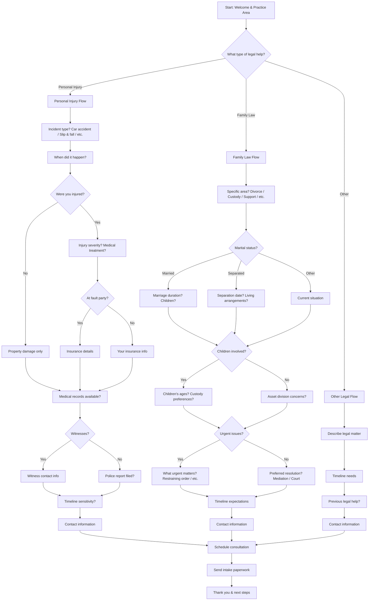

# Legal Firm Client Intake - Interactive Voice Workflow

This script is designed for personal injury or family law firms to gather essential case details from potential clients through an interactive voice workflow on their website. It uses **branching logic** to qualify cases and collect structured information for initial case evaluation.

---

---

## Step Scripts

### A - Start: Welcome & Practice Area
**Voice Script:** Welcome to [Law Firm Name]. I'm here to help you understand your legal options and gather information for a free consultation. What type of legal matter brings you here today?

### B - What type of legal help?
**Voice Script:** Thank you for reaching out. We handle personal injury cases, family law matters, and other legal issues. Which category best describes your situation?

### PI - Personal Injury Flow
**Voice Script:** I'm sorry to hear you've been involved in an incident. Personal injury law can help you recover compensation. Let's gather some details about what happened.

### PI1 - Incident type?
**Voice Script:** What type of incident occurred? For example, a car accident, slip and fall, workplace injury, or something else?

### PI2 - When did it happen?
**Voice Script:** When did this incident occur? This is important for determining if we can still pursue your case.

### PI3 - Were you injured?
**Voice Script:** Were you injured in this incident, or is this primarily about property damage?

### PI4 - Injury severity?
**Voice Script:** Can you tell me about your injuries and what medical treatment you've received? This helps us understand the severity and potential compensation.

### PI5 - Property damage only
**Voice Script:** I understand this is primarily about property damage. Even without personal injury, there may be compensation available.

### PI6 - At fault party?
**Voice Script:** Was the other party clearly at fault, or is there any question about who was responsible?

### PI7 - Insurance details
**Voice Script:** What do you know about the other party's insurance coverage?

### PI8 - Your insurance info
**Voice Script:** Do you have insurance that might be involved, such as auto insurance or health insurance?

### PI9 - Medical records available?
**Voice Script:** Do you have medical records or bills from this incident that we can review?

### PI10 - Witnesses?
**Voice Script:** Were there any witnesses to the incident?

### PI11 - Witness contact info
**Voice Script:** Could you provide contact information for any witnesses? This can strengthen your case.

### PI12 - Police report filed?
**Voice Script:** Was a police report filed? If so, do you have the report number?

### PI13 - Timeline sensitivity?
**Voice Script:** Is there any time sensitivity to your case? Some claims have strict deadlines.

### PI14 - Contact information
**Voice Script:** Thank you for sharing these details. To schedule your free consultation, may I have your contact information?

### FL - Family Law Flow
**Voice Script:** Family law matters can be emotionally challenging. We're here to help you navigate this difficult time. Let's discuss your situation.

### FL1 - Specific area?
**Voice Script:** What specific area of family law are you dealing with? Divorce, child custody, child support, spousal support, or another family matter?

### FL2 - Marital status?
**Voice Script:** What's your current marital status?

### FL3 - Marriage duration?
**Voice Script:** How long have you been married, and do you have children together?

### FL4 - Separation date?
**Voice Script:** When did you separate, and what's your current living arrangement?

### FL5 - Current situation
**Voice Script:** Can you tell me more about your current situation?

### FL6 - Children involved?
**Voice Script:** Are children involved in this matter?

### FL7 - Children's ages?
**Voice Script:** What are your children's ages, and do you have any preferences regarding custody arrangements?

### FL8 - Asset division concerns?
**Voice Script:** Are there significant assets, property, or financial matters that need to be addressed?

### FL9 - Urgent issues?
**Voice Script:** Are there any urgent issues that need immediate attention?

### FL10 - What urgent matters?
**Voice Script:** What urgent matters need to be addressed? This could include temporary custody, support, or protection orders.

### FL11 - Preferred resolution?
**Voice Script:** What type of resolution are you hoping for? Mediation, collaborative divorce, or court proceedings?

### FL12 - Timeline expectations
**Voice Script:** What's your timeline for resolving this matter? Some issues require quicker attention than others.

### FL13 - Contact information
**Voice Script:** Thank you for sharing these important details. Let me get your contact information to schedule a confidential consultation.

### O - Other Legal Flow
**Voice Script:** I understand you have a different type of legal matter. We handle various legal issues. Tell me about your situation.

### O1 - Describe legal matter
**Voice Script:** Can you describe the legal matter you're dealing with?

### O2 - Timeline needs
**Voice Script:** Is there any time sensitivity to this legal matter?

### O3 - Previous legal help?
**Voice Script:** Have you consulted with another attorney or had previous legal assistance with this matter?

### O4 - Contact information
**Voice Script:** Let me get your contact information so we can discuss this further.

### Z - Schedule consultation
**Voice Script:** Based on what you've shared, this sounds like a case where we can help. I'd like to schedule a free, confidential consultation to discuss your options.

### Z1 - Send intake paperwork
**Voice Script:** I'll send you some initial intake paperwork to help us prepare for our meeting.

### END - Thank you & next steps
**Voice Script:** Thank you for trusting us with your legal matter. You'll receive an email shortly with consultation details and next steps. We're here to help!
