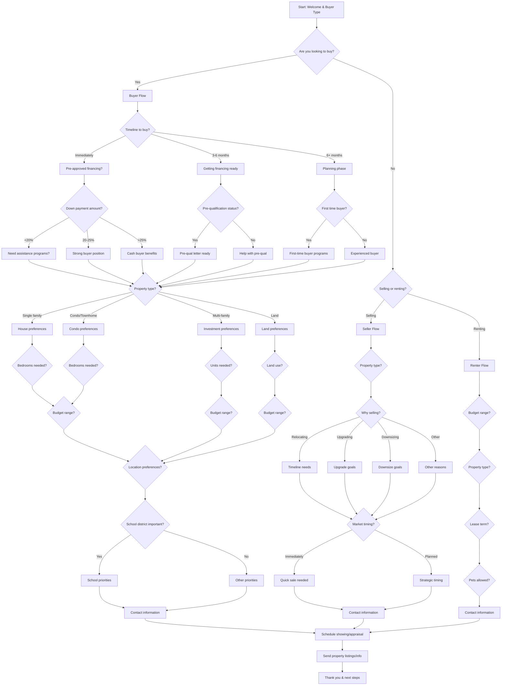

# Real Estate Agency Buyer Qualification - Interactive Voice Workflow

This script is designed for real estate agencies to qualify potential buyers and gather essential property requirements through an interactive voice workflow on their website. It uses **branching logic** to determine buyer needs and schedule property showings.

---

---

## Step Scripts

### A - Start: Welcome & Buyer Type
**Voice Script:** Welcome to [Real Estate Agency Name]! I'm here to help you with your real estate needs. Are you looking to buy a property today?

### B - Are you looking to buy?
**Voice Script:** Great! Whether you're buying, selling, or renting, we can help. What brings you to our site today?

### C - Buyer Flow
**Voice Script:** Excellent! Buying a home is an exciting decision. Let's find properties that match your needs.

### C1 - Timeline to buy?
**Voice Script:** What's your timeline for purchasing? Are you ready to buy immediately, in 3-6 months, or further out?

### C2 - Pre-approved financing?
**Voice Script:** Have you been pre-approved for financing? This helps us focus on properties in your price range.

### C3 - Getting financing ready
**Voice Script:** That's a great timeline! We can help you get pre-qualified while we search for properties.

### C4 - Planning phase
**Voice Script:** Planning ahead is smart! We can help you understand the market and get ready to buy.

### C5 - Down payment amount?
**Voice Script:** What's your down payment amount? This affects which properties qualify for your budget.

### C6 - Pre-qualification status?
**Voice Script:** Have you started the pre-qualification process with a lender?

### C7 - First time buyer?
**Voice Script:** Are you a first-time homebuyer? We have special programs and guidance for first-timers.

### C8 - Need assistance programs?
**Voice Script:** With a smaller down payment, you may qualify for FHA loans or other assistance programs.

### C9 - Strong buyer position
**Voice Script:** A 20-25% down payment puts you in a very strong position with sellers!

### C10 - Cash buyer benefits
**Voice Script:** Cash buyers often have an advantage in competitive markets.

### C11 - Pre-qual letter ready
**Voice Script:** Perfect! Having a pre-qualification letter ready will make offers much stronger.

### C12 - Help with pre-qual
**Voice Script:** We can connect you with trusted lenders for pre-qualification.

### C13 - First-time buyer programs
**Voice Script:** First-time buyers qualify for special loan programs and down payment assistance!

### C14 - Experienced buyer
**Voice Script:** Experienced buyers often have streamlined processes. Let's focus on your goals.

### C15 - Property type?
**Voice Script:** What type of property are you interested in?

### C16 - House preferences
**Voice Script:** Single-family homes offer privacy and space. Let's narrow down your preferences.

### C17 - Condo preferences
**Voice Script:** Condos often have lower maintenance and amenities. What are you looking for?

### C18 - Investment preferences
**Voice Script:** Multi-family properties can provide rental income. What's your investment strategy?

### C19 - Land preferences
**Voice Script:** Building your dream home on land gives you complete control over the design.

### C20 - Bedrooms needed?
**Voice Script:** How many bedrooms do you need? Don't forget to consider future needs.

### C21 - Bedrooms needed?
**Voice Script:** How many bedrooms are you looking for in the condo?

### C22 - Units needed?
**Voice Script:** How many units are you considering? 2-unit, 3-unit, or larger?

### C23 - Land use?
**Voice Script:** What do you plan to use the land for? Residential building, commercial development, or agricultural?

### C24 - Budget range?
**Voice Script:** What's your budget range for the complete purchase?

### C25 - Budget range?
**Voice Script:** What's your investment budget range?

### C26 - Budget range?
**Voice Script:** What's your budget range for the land purchase?

### C27 - Location preferences?
**Voice Script:** Which neighborhoods or areas are you interested in?

### C28 - School district important?
**Voice Script:** Are schools an important factor in your decision?

### C29 - School priorities
**Voice Script:** What are your school priorities? Test scores, class size, or special programs?

### C30 - Other priorities
**Voice Script:** What other factors are important? Commute time, amenities, or lifestyle?

### C31 - Contact information
**Voice Script:** Perfect! You sound like a qualified buyer. Let me get your contact information to send listings and schedule showings.

### D - Selling or renting?
**Voice Script:** No problem! Are you looking to sell a property or find a rental?

### E - Seller Flow
**Voice Script:** Great! Selling your home is a big decision. Let's discuss your goals.

### E1 - Property type?
**Voice Script:** What type of property are you selling?

### E2 - Why selling?
**Voice Script:** What's motivating you to sell? This helps us position your home to the right buyers.

### E3 - Timeline needs
**Voice Script:** Relocating often requires quick sales. What's your timeline?

### E4 - Upgrade goals
**Voice Script:** Upgrading is exciting! What improvements are you hoping to make?

### E5 - Downsize goals
**Voice Script:** Downsizing can simplify life. What are your priorities for the next chapter?

### E6 - Other reasons
**Voice Script:** Can you tell me more about why you're selling?

### E7 - Market timing?
**Voice Script:** When are you hoping to list your property?

### E8 - Quick sale needed
**Voice Script:** We understand time-sensitive situations. Let's get your home market-ready quickly.

### E9 - Strategic timing
**Voice Script:** Strategic timing is important. We can help you choose the best moment to sell.

### E10 - Contact information
**Voice Script:** Excellent! Let me get your contact information for a complimentary market analysis.

### F - Renter Flow
**Voice Script:** Finding the right rental is important. Let's find properties that fit your needs.

### F1 - Budget range?
**Voice Script:** What's your monthly budget for rent?

### F2 - Property type?
**Voice Script:** What type of rental are you looking for? Apartment, house, condo, or townhome?

### F3 - Lease term?
**Voice Script:** What lease term are you looking for? Month-to-month, 6 months, 1 year, or longer?

### F4 - Pets allowed?
**Voice Script:** Do you have pets that need to be accommodated?

### F5 - Contact information
**Voice Script:** Great! Let me get your contact information to send rental listings.

### Z - Schedule showing/appraisal
**Voice Script:** Based on what you've shared, I have some properties/listings that would be perfect for you. Would you like to schedule a showing or market analysis?

### Z1 - Send property listings/info
**Voice Script:** I'll send you detailed listings and information via email, along with our buyer's guide if you're purchasing.

### END - Thank you & next steps
**Voice Script:** Thank you for sharing your real estate needs! You'll receive information shortly. We're here to help make your real estate dreams a reality!
