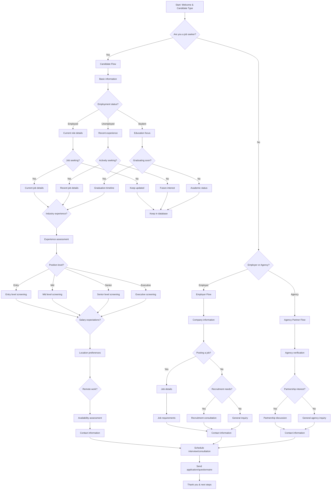

# Recruitment Agency Candidate Pre-Screening - Interactive Voice Workflow

This script is designed for recruitment agencies to conduct initial candidate screening and gather essential qualification information through an interactive voice workflow on their website. It uses **branching logic** to assess candidates and route them to appropriate positions.

---

---

## Step Scripts

### A - Start: Welcome & Candidate Type
**Voice Script:** Welcome to [Recruitment Agency Name]! I'm here to help connect talented professionals with great opportunities. Are you a job seeker looking for new opportunities?

### B - Are you a job seeker?
**Voice Script:** Great! We help both job seekers and employers. How can we assist you today?

### C - Candidate Flow
**Voice Script:** Excellent! Let's find out about your background and career goals so we can match you with the right opportunities.

### C1 - Basic information
**Voice Script:** Let's start with some basic information. What's your full name and contact details?

### C2 - Employment status?
**Voice Script:** What's your current employment status?

### C3 - Current role details
**Voice Script:** Can you tell me about your current role and how long you've been there?

### C4 - Recent experience
**Voice Script:** What's your most recent work experience and when did you leave that position?

### C5 - Education focus
**Voice Script:** What are you studying and what's your expected graduation date?

### C6 - Job seeking?
**Voice Script:** Are you actively looking for new job opportunities?

### C7 - Actively seeking?
**Voice Script:** Are you actively seeking employment right now?

### C8 - Graduating soon?
**Voice Script:** Are you graduating soon and looking for entry-level positions?

### C9 - Current job details
**Voice Script:** Can you tell me about your current job title, company, and responsibilities?

### C10 - Keep updated
**Voice Script:** We'll keep your information on file for future opportunities that match your background.

### C11 - Recent job details
**Voice Script:** Can you tell me about your most recent position and what you're looking for now?

### C12 - Future interest
**Voice Script:** We'll keep your information for when you're ready to explore new opportunities.

### C13 - Graduation timeline
**Voice Script:** What's your graduation timeline and what type of role are you interested in?

### C14 - Academic status
**Voice Script:** What year are you in school and do you have any work experience?

### C15 - Industry experience?
**Voice Script:** What industry or field do you have experience in?

### C16 - Keep in database
**Voice Script:** We'll keep your profile in our database for relevant opportunities.

### C17 - Experience assessment
**Voice Script:** Based on your experience, let's assess what level of positions would be a good fit.

### C18 - Position level?
**Voice Script:** What level of position are you targeting in your job search?

### C19 - Entry level screening
**Voice Script:** Entry-level positions focus on potential and willingness to learn. What skills are you developing?

### C20 - Mid level screening
**Voice Script:** Mid-level roles require 3-7 years of experience. What's your specialty area?

### C21 - Senior level screening
**Voice Script:** Senior positions need 7+ years of experience and leadership skills. What's your area of expertise?

### C22 - Executive screening
**Voice Script:** Executive roles require significant leadership experience. What's your background in management?

### C23 - Salary expectations?
**Voice Script:** What are your salary expectations for new opportunities?

### C24 - Location preferences
**Voice Script:** What locations are you open to for work? Local, regional, or remote?

### C25 - Remote work?
**Voice Script:** Are you interested in remote work opportunities, or do you prefer office-based roles?

### C26 - Availability assessment
**Voice Script:** When would you be available to start a new position?

### C27 - Contact information
**Voice Script:** Perfect! Let me get your contact information so we can discuss specific opportunities that match your profile.

### D - Employer or Agency?
**Voice Script:** No problem! Are you an employer looking to hire, or another recruitment agency?

### E - Employer Flow
**Voice Script:** Great! We help employers find the perfect candidates for their teams.

### E1 - Company information
**Voice Script:** Let's start with some information about your company and your hiring needs.

### E2 - Posting a job?
**Voice Script:** Are you looking to post a job opening with us?

### E3 - Job details
**Voice Script:** Can you tell me about the position you're looking to fill?

### E4 - Recruitment needs?
**Voice Script:** Are you looking for recruitment consultation or other HR services?

### E5 - Job requirements
**Voice Script:** What are the key requirements and qualifications for this position?

### E6 - Recruitment consultation
**Voice Script:** We'd love to discuss how we can help with your recruitment needs.

### E7 - General inquiry
**Voice Script:** How can we assist you with your HR or recruitment questions?

### E8 - Contact information
**Voice Script:** Let me get your contact information so we can discuss your recruitment needs.

### F - Agency Partner Flow
**Voice Script:** Agency partnerships help us serve more clients effectively.

### F1 - Agency verification
**Voice Script:** Can you tell me about your agency and how we might work together?

### F2 - Partnership interest?
**Voice Script:** Are you interested in exploring a partnership with our agency?

### F3 - Partnership discussion
**Voice Script:** We'd love to discuss partnership opportunities and how we can collaborate.

### F4 - General agency inquiry
**Voice Script:** How can we help you with your agency needs?

### F5 - Contact information
**Voice Script:** Let me get your contact information to follow up on partnership opportunities.

### Z - Schedule interview/consultation
**Voice Script:** Based on what you've shared, I'd like to schedule a more detailed discussion about your opportunities or needs.

### Z1 - Send application/questionnaire
**Voice Script:** I'll send you additional application materials or consultation details via email.

### END - Thank you & next steps
**Voice Script:** Thank you for your interest in [Recruitment Agency Name]! You'll receive follow-up information shortly. We're excited to help you achieve your career goals!
