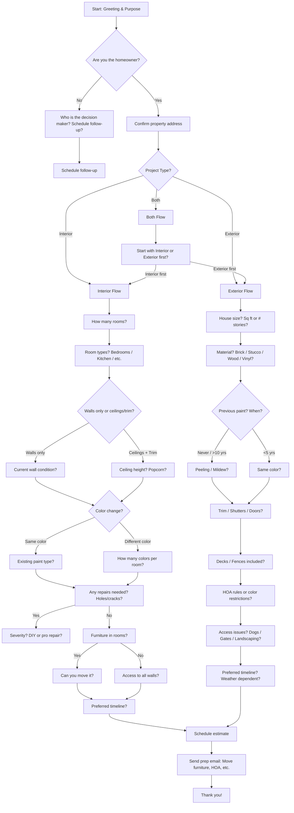

# Residential Painting Estimate - Info Gathering Conversation Script

This script is designed for a painter (P) to gather essential details from a client (C) before providing an estimate. It uses **branching logic** based on client responses. The flow is structured as a decision tree with clear paths.

---

---

## Step Scripts

### A - Start: Greeting & Purpose
**Script:** Hi, this is [Your Name] with [Company]. I'm here to gather details for your painting estimate. How can I help you today?

### B - Are you the homeowner?
**Script:** Great! Are you the homeowner or decision maker?

### C - Confirm property address
**Script:** Perfect. Can you confirm the property address for me?

### D - Who is the decision maker?
**Script:** May I speak with the homeowner or decision maker, or would you prefer to have them complete this survey at a better time?

### E - Schedule follow-up
**Script:** No problem. What would be a good time for them to complete this? We can send them a link to continue the survey then.

### F - Project Type?
**Script:** Excellent. Are we looking at interior painting, exterior painting, or both?

### G - Interior Flow
**Script:** Great, let's talk about the interior project.

### G1 - How many rooms?
**Script:** How many rooms are we painting?

### G2 - Room types?
**Script:** What types of rooms? For example, bedrooms, bathrooms, kitchen, living room?

### G3 - Walls only or ceilings/trim?
**Script:** For each room, are we doing walls only, or walls plus ceilings and trim?

### G4 - Current wall condition?
**Script:** What's the current condition of the walls? Any damage or repairs needed?

### G5 - Ceiling height? Popcorn?
**Script:** Are the ceilings standard 8 feet or higher? And do any have popcorn texture?

### G6 - Color change?
**Script:** Are you changing colors dramatically, like going from light to dark or vice versa?

### G7 - Existing paint type?
**Script:** Do you know the current paint finish? Like flat, eggshell, or semi-gloss?

### G8 - How many colors per room?
**Script:** Will each room have one color or are you planning accent walls?

### G9 - Any repairs needed?
**Script:** Are there any wall repairs needed? Things like nail holes, cracks, or water stains?

### G10 - Severity?
**Script:** Would you say these are minor repairs like nail holes, or major ones like cracks over a quarter inch?

### G11 - Furniture in rooms?
**Script:** Will furniture be staying in the rooms during painting?

### G12 - Can you move it?
**Script:** Are you able to move the furniture, or would you like us to handle that?

### G13 - Access to all walls?
**Script:** Do we have full access to all the walls?

### G14 - Preferred timeline?
**Script:** What's your preferred timeline for this project?

### H - Exterior Flow
**Script:** Perfect, let's discuss the exterior project.

### H1 - House size?
**Script:** What's your home's approximate square footage, or how many stories is it?

### H2 - Material?
**Script:** What's the exterior material? Is it brick, stucco, wood siding, or vinyl?

### H3 - Previous paint?
**Script:** When was the exterior last painted?

### H4 - Peeling / Mildew?
**Script:** Is there any peeling paint, chalking, or mildew that you've noticed?

### H5 - Same color?
**Script:** Are you keeping the same color or changing it?

### H6 - Trim / Shutters / Doors?
**Script:** Are we including trim, shutters, doors, or the garage in this project?

### H7 - Decks / Fences included?
**Script:** Do you have any decks, fences, or railings that need painting?

### H8 - HOA rules?
**Script:** Are you in an HOA with any color restrictions or approval requirements?

### H9 - Access issues?
**Script:** Are there any access issues we should know about? Like dogs, locked gates, or heavy landscaping?

### H10 - Preferred timeline?
**Script:** What's your preferred timeline? Keep in mind exterior painting is weather dependent.

### I - Both Flow
**Script:** Sounds good. We'll cover both interior and exterior. Would you like to start with the interior or exterior details first?

### I1 - Start with Interior or Exterior first?
**Script:** Let's begin with whichever is more important to you.

### Z - Schedule estimate
**Script:** Based on what you've shared, I'd like to schedule a free estimate to measure and confirm details. Are you available this week?

### Z1 - Send prep email
**Script:** Perfect! I'll send you a confirmation email with what to have ready, like furniture access, HOA documents, and color samples if you have them.

### END - Thank you!
**Script:** Thank you so much for your time! We'll see you on [date/time]. Have a great day!
