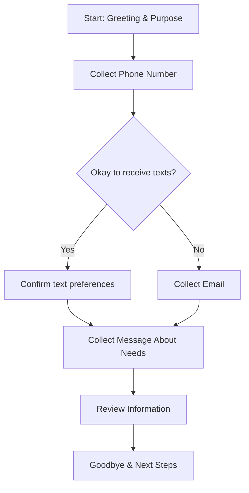

# General Contact Collection

A simple survey to collect customer contact information and their needs.

## Flow Diagram

## Steps

### A - Start: Greeting & Purpose
**Type:** action
**Script:** Hello! Thank you for giving us the opportunity to discuss your needs. I'm here to gather some information so we can better assist you. This will only take a couple of minutes. Does that sound ok?

### B - Collect Phone Number
**Type:** question
**Script:** First, could you please provide your phone number so we can follow up with you?

### C - Okay to receive texts?
**Type:** decision
**Script:** Great, thank you. Would you mind if we send you text messages for quick updates and communication? It's often the fastest way to keep you informed.

### D - Confirm text preferences
**Type:** action
**Script:** Perfect! We'll use text messages to keep you updated. You can always opt out at any time by replying STOP to any of our messages.

### E - Collect Email
**Type:** question
**Script:** No problem at all. Could you provide your email address instead? We'll use that for all our communications with you.

### F - Collect Message About Needs
**Type:** question
**Script:** Now, could you tell me briefly what brings you here today? What can we help you with?

### I - Review Information
**Type:** action
**Script:** Great! Let me quickly review what we've collected. We have your contact information and understand what you're looking for. Someone from our team will reach out to you shortly to discuss the next steps.

### J - Goodbye & Next Steps
**Type:** end
**Script:** Thank you so much for your time today! We really appreciate you reaching out. You should expect to hear from us within one business day. Have a wonderful day!

